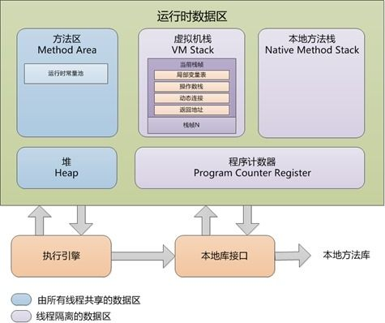

# Java面试题汇总

## Java虚拟机

#### Java虚拟机运行时的数据区

##### Java 虚拟机运行时内存图

在JDK1.8之前，JVM 运行时数据区分为程序计数器、堆、虚拟机栈、本地方法栈、方法区、运行时常量池、直接内存。

##### 程序计数器

线程私有，此内存区域是唯一一个在Java虚拟机规范中没有规定任何 `OutOfMemoryError` 情况的区域

- 如果线程正在执行的是Java 方法，则这个计数器记录的是正在执行的虚拟机字节码指令地址
- 如果正在执行的是Native 方法，则这个计数器值为空（Undefined）

##### 虚拟机栈

线程私有，每个栈帧对应一次方法调用。

栈帧中存放了局部变量表（基本数据类型变量和对象引用）、操作数栈、方法出口等信息。当栈的深度超过 JVM 所允许的范围，就会抛出 `StackOverflowError` 的错误。

##### 本地方法栈

线程私有，主要与虚拟机用到的 Native 方法相关。

##### 方法区

线程共享

存放已加载类的信息（包括类的字节码，类的结构）、常量、静态变量等。

##### 堆

堆中存放的是对象（包括数组）。当申请不到空间时会抛出OutOfMemoryError。

#### HotSpot 虚拟机的方法区在 JDK7 中有何变化，为什么做这些变化？

- 符号引用（Symbols）转移到了 native heap。
- 字面量（interned strings）转移到了 java heap。
- 类的静态变量（class statics）转移到了 java heap。

#### JDK8 中的元空间

在JDK8中，永久代已经不存在，类信息、编译后的代码数据等已经移动到MetaSpace（元空间）中，元空间不在堆内存中，直接中用本地内存（NativeMemory）。元空间和永久代的本质类似，都是对JVM规范中方法区的实现。  

JDK9 中的永久代被元空间替换，有如下原因：

- 永久代由 MaxPermSize 控制，而永久区由系统的实际可用空间来控制，后者不容易出现内存溢出问题。
- Oracle 后期有可能 将 HotSpot 和 JRockit 两种虚拟机代码合并，JRockit 中没有永久代但运行良好

#### PermGen（永久代）

“方法区”是JVM的规范，而“永久代”是方法区的一种实现，并且只有HotSpot才有“PermGen space”，而对于其他类型的虚拟机并没有“PermGen space”。

#### 堆内存划分

在JDK7及之前的JDK版本中，堆内存通常被分为三块区域：Young Generation（年轻代）、Old Generation（年老代）、Permanent Generation for VM Matedata（永久代）。  

#### 简述类加载器的双亲委派模型

对于任意一个类，都需要由加载它的类加载器和这个类本身来一同确立其在 Java 虚拟机中的唯一性。我们通常采用 equals() 方法，isInstance() 方法和 isAssignableFrom() 方法。来判断，对于同一个路径下的类，如果没有采用相同的类加载器来加载，则 JVM 会认为它们是不相等的。

**双亲委派**：如果一个类加载器收到了加载某个类的请求,则该类加载器并不会去加载该类,而是把这个请求委派给父类加载器,每一个层次的类加载器都是如此,因此所有的类加载请求最终都会传送到顶端的启动类加载器;只有当父类加载器在其搜索范围内无法找到所需的类,并将该结果反馈给子类加载器,子类加载器会尝试去自己加载。

执行加载的流程如下：

1. 子类先委托父类加载
2. 父类加载器有自己的**加载范围**，范围内没有找到，则不加载，并返回给子类
3. 子类在收到父类无法加载的时候，才会自己去加载

JVM 提供了三种系统加载器：

1. 启动类加载器（Bootstrap ClassLoader）：C++实现，在java里无法获取，**负责加载/lib**下的类。
2. 扩展类加载器（Extension ClassLoader）： Java实现，可以在java里获取，**负责加载/lib/ext**下的类。
3. 系统类加载器/应用程序类加载器（Application ClassLoader）：是与我们接触对多的类加载器，我们写的代码默认就是由它来加载，ClassLoader.getSystemClassLoader返回的就是它。

#### 为什么要破坏双亲委派模型？

因为在某些情况下父类加载器需要委托子类加载器去加载 class 文件。受到加载范围的限制，父类加载器无法加载到需要的文件，以 Driver 接口为例，由于 Driver 接口定义在  JDK 当中的，而其实现由各个数据库的服务商来提供，比如 mysql 的就写了 `MySQL Connector`，那么问题就来了， DriverManager（也由jdk提供）要加载各个实现了 Driver 接口的实现类，然后进行管理，但是 DriverManager 由启动类加载器加载，只能记载 JAVA_HOME 的 lib 下文件，而其实现是由服务商提供的，由系统类加载器加载，这个时候就需要启动类加载器来委托子类来加载 Driver 实现，从而破坏了双亲委派，这里仅仅是举了破坏双亲委派的其中一个情况。

#### 运行时的栈帧的数据结构

栈帧(Stack Frame)是用于支持虚拟机进行方法调用和方法执行的数据结构，它是虚拟机运行时数据区的虚拟机栈(Virtual Machine Stack)的栈元素。栈帧存储了方法的**局部变量表，操作数栈，动态连接和方法返回地址**等信息。第一个方法从调用开始到执行完成，就对应着一个栈帧在虚拟机栈中从入栈到出栈的过程。

#### 局部变量表

局部变量表是一组变量值存储空间，用于存放方法参数和方法内部定义的局部变量。