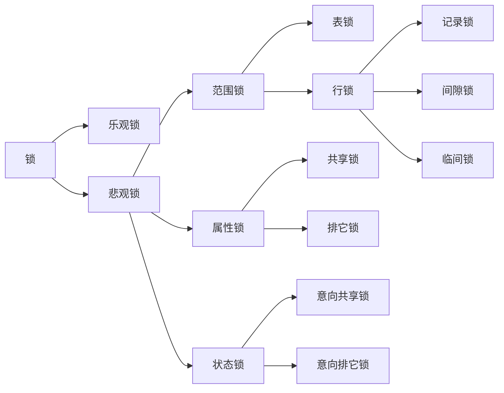

# 数据库

## 数据库基础

### 数据库的三范式是什么

- 第一范式：强调的是列的原子性，即数据库表的每一列都是不可分割的原子数据项。
- 第二范式：确保表中的每列都和主键相关。也就是说在一个数据库表中，一个表中只能保存一种数据，不可以把多种数据保存在同一张数据库表中。
- 第三范式：确保每列都和主键直接相关,而不是间接相关。

### 什么是主键、外键、超键和候选键

**超键**：在关系中能唯一标识元组的属性集称为关系模式的超键。一个属性可以为作超键，多个属性组合在一起也可以作为一个超键。超键包含候选键和主键。

**候选键**：是最小超键，即没有冗余元素的超键。

**主键**：数据库表中对储存数据对象予以唯一和完整标识的数据列或属性的组合。一个数据列只能有一个主键，且主键的取值不能缺失，即不能为空值（NULL）。

**外键**：在一个表中存在另一个表的主键称此表的外键。

### 什么是存储过程？用什么来调用

存储过程是一个预编译的 SQL 语句优点是允许模块化的设计，就是只需创建一次，以后在该程序中就可以调用多次。如果某次操作需要执行多次 SQL，使用存储过程比单纯 SQL 语句执行要快。

### 存储过程的优缺点

优点：

- 存储过程是预编译过的，执行效率高
- 存储过程的代码直接存放于数据库中，通过存储过程名直接调用，减少刚和通讯。
- 安全性高，执行存储过程需要有一定权限的用户。
- 存储过程可以重复使用，可减少数据库开发人员的工作量。

缺点：

- 移植性差

### 什么是视图和游标

视图：是一种虚拟的表，具有和物理表相同的功能。可以对视图进行增、改、查操作，视图通常是一个或多个表的行或列的子集。对视图的修改会影响基本表。它使得我们获取数据更容易，相比多表查询。

游标：是对查询出来的结果作为一个单元来有效地处理。游标可以定在该单元中的特定行，从结果集的当前行检索一千或多选。可以对结果集妆前行做修改。一般不使用游标，但是需要逐条处理数据的时候，游标显得十分重要。

### 视图的优缺点

优点：

- 简化对数据库的访问，视图可以通过简单的查询得到复杂的结果
- 维护数据的独立性，视图可以从多个表检索数据

缺点：

- 性能：查询视图时，必须把视图的查询转化成对基本表的查询，如果这个视图是由一个复杂的金表查询所定义，那么就无法更改数据

### 非关系开考数据库和关系型数据库区别，优势比较

非关系型数据 库的优势：

- 性能：NOSQL 是基于键值对的，可以想象成表中的主键和值的对应关系，而且不需要经过 SQL 层的解析，所以性能非常高。
- 可扩展性：同样也是因为基于键值对，数据之间没有耦合性，所以非常容易水平扩展

其他：
​ 对于这两类数据库，对方的优势就是自己的弱势，反之亦然。
​ NOSQL 数据库慢慢开始具备 SQL 数据库的一些复杂查询功能，比如 MongoDB。
​ 对于事务的支持也可以用一些系统级的原子操作来实现例如乐观锁之类的方法来曲线救国，比如 Redis set nx。

### 什么是内连接、外连接、交叉连接、笛卡尔积

内连接：只连接匹配的行

左外连接：包含左边表的全部行（不管右边的表中是否存在与它们匹配的行），以及右边表中全部匹配的行

右外连接：包含右边表的全部行（不管左边的表中是否存在与它们匹配的行），以及左边表中全部匹配的行

全外连接：包含左、右两个表的全部行、不管另外一边的表中是否存在与它们匹配的行。

交叉连接：生成笛卡尔积，它不使用任何匹配或者选取条件，而是直接将一个数据 源中的每个行与另一个数据 源的每个行都一一匹配

### SQL 语言分类

数据查询语言 DQL（Data Query Language）

`SELECT`

数据操纵语言 DML（Data Management Language）

`INSERT, UPDATE, DELETE`

数据定义语言（Data Define Language）

`CREATE TABLE/VIEW/INDEX/SYN/CLUSTER`

数据控制语言（Data Control Language）

`GRANT, ROLLBACK, COMMIT`

### like 中 `%` 和 `_` 的区别

`%` 通配符表示任何字符出现任意次
`_` 通配符表示只能匹配单个字符

注意事项：

- 大小写，有使用模糊匹配时，也就是匹配文本时，MySQL 是可能区分大小的，也可能 是不区分大小写的，这个结果是取决于用户对 MySQL 的配置方式。
- 注意尾部空格，“%yves”是不能匹配“heyves ”这样的记录的。
- 注意 `NULL`，`%` 通配符可以匹配任意字符，但是不能匹配 NULL，也就是说无法匹配到值为 `NULL` 的记录的。

技巧与建议：正如所见，MySQL 的通配符很有用。但这种功能是有代价的，通配符搜索的处理一般要比前面讨论的其他搜索所花时间更长。这是给出一些使用熊本符要记住的技巧。

- 不要过度使用通配符。如果其他操作符能达到相同的目的，应该使用其他操作符。
- 在确实需要使用通配符时，除非绝对有必要，否则不要把它们用在搜索模式的开始处。把通配符相去不远搜索模式的开始处，搜索起来是最慢的。

### 查询语句不同元素（where、join、limit、group by、having）执行的先后顺序

查询中用到的关键词主要包含六个，并且他们的顺序依次为 select - from - where - group by - having - order by

其中 select 和 from 是必须的，其他关键词是可选的，这六个关键词的顺序与 sql 语句的书写顺序并不一样，而是按照下面的顺序来执行：

from - where - group by - having - select - order by

### from 后面的表关联，是自右向左解析，而 where 条件的解析顺序是自下而上的

也就是说，在写 SQL 语句的时候，尽量把数据量小的表放在最右边来进行关联（用小青去匹配大表），而把能筛选出小量数据的条件放在 where 语句的最左边（用小表去匹配大表）

数据库为每个数据项维护多个版本（快照），每个事务只对属于自己的私有快照进行更新，在事务真正提交前进行有效性检查，使得事务正常提交更新或者失败回滚。

## 数据库索引

### 什么是索引

数据库索引，是数据库管理系统中一个排序的数据结构，它们心某种方式指向数据，能够满足特定的查找算法。

### 索引的优缺点

创建索引可以大大地提高系统的查询性能（优点）：

- 通过创建唯一必索引，可以保证数据库表中每一行数据的唯一性
- 可以大大回忆数据的检索速度，这也是创建索引的主要原因。
- 可以加速表和表之间的连接，特别是在实现数据的参考完整性方面特别有意义。
- 在使用分组和排序子句进行数据检索时，同样可以郝蕾减少查询中分组和排序的时间。
- 通过使用索引，可以在查询的过程中，使用优化隐藏器，提高系统的性能。

增加索引也有许多不利的方面（缺点）：

- 创建索引和维护索引要耗费时间，这种时间随着数据量的增加而增加。
- 索引需要占物理空间，除了数据表占数据空间之外，每一个索引不分占一定的物理空间，如果要建立聚簇索引，那么需要的空间就会更大。
- 当对表中的数据进行增加，删除和修改的时候，索引也要动态的维护，这样就降低了数据的维护速度。

### 哪些列适合建立索引、哪些不适合建索引

索引是建立在数据库表中的某些列的上面。在创建索引的时候，哪些列上可以创建索引，在哪些列上不能创建索引。

一般来说，应该在这些列上创建索引：

- 在经常需要搜索的列上，强制该列的唯一性和组织表中数据的排列结构。
- 在经常用在连接的列上，这些列主要是一些外键，可以回忆连接的速度。
- 在经常需要根据范围进行搜索的列上创建索引，因为索引已经排序，其指定的范围是连续的。
- 在经常需要排序的列上创建索引，转化为索引已经排序，这样查询可以利用睥排序，回忆排序查询里间。
- 在经常需要排序的列上创建索引，因为索引已经排序，这样查询可以利用索引的排序，加快排序查询时间。
- 在经常使用在 WHERE 子句中的列上面创建索引，加快条件的判断速度。

对于有些列不应该创建索引：

- 对于那些在查询中很少使用或者参考的列不应该创建索引。由于这些列的取值很少，例如人事表的性别列，在查询的结果中结果集的数据行占了表中数据行的很大比例，即需要在表中搜索的数据行的比例很大。增加索引，并不能明显回忆检索速度。
- 对于那些只有很少数据值的列也不应该增加索引。由于这些列的聚会很少，例如从事表的性别列，在查询的结果中，结果集的数据行占了数据行的很大比例，即需要在表中搜索的数据行的比例很大。增加索引，并不能明显回忆检索速度。
- 对于那些定义为 text，image，bit 数据类型的列不应该增加索引。因为这些列的数据量要么相当大，要么取值很少。
- 当修改性能远远大于检索性能时，不应该创建索引。因为修改性能和检索性能是互相矛盾的。当增加索引时，会提高检索性能，俚是会降低修改性能。当减少索引时，会提高修改性能，降低检索性能。因此，当修改性能远远大于检索性能时，不应该创建索引。

### 什么样的字段适合建索引

唯一、不为空、经常被查询的字段

### 聚集索引（聚合索引）和非聚集索引

#### 聚集索引

表记录的排列顺序和索引的排列顺序一致，所以查询效应快，只要找到第一个索引值记录，其余就连结尾的记录在物理也一样连续存放。聚集索引对应的缺点就是修改修改慢，因为为了保证表中记录的物理和索引顺序一致，在记录插入的时候，会对数据面重新排序。

聚集索引类似于新华字典中用拼音去查找汉字，拼音检索表于书记顺序老师按照 a~z 排列的，就像相同的逻辑顺序于物理顺序一样，当你需要查找 a，ai 两个读音的字，或是想一次寻找多个傻（sha）的同音字时，也许身后翻网页，或紧接着下一行就得到结果了。

#### 非聚集索引

指定了表中记录的逻辑顺序，但是记录的物理和索引不一定一致，两种索引都采用 B+ 树结构，非聚集索引的叶子层并不和实际数据面相重叠，而采用叶子层包含一个指向表中的记录在数据页中的指针方式。非聚集索引层次多，不会造成数据重排。

非聚集索引类似在新华字典上通过偏旁问道来查询汉字，检索表也许是按照横、竖、撇来排列的，但是由于正文中是 a ~ z 的拼音顺序，所以就类似于逻辑地址于物理地址的不对应。同时适用的情况就在于分组，大数目的不同会，频繁更新的列中，这些情况即不适合聚集索引。

根本区别：

聚集索引和非聚集索引的根本区别是表记录的排列顺序和与索引的排列顺序是否一致。

## 数据库事务

### 什么是事务

事务是对数据库中一系列操作进行统一的回滚或者提交的操作，主要用来保证数据的完整性和一致性。

### 事务的传播行为

1. PROPAGATION_REQUIRED：如果当前没有事务，就创建一个新事务，如果当前存在事务，就加入该事务，该油墨是最常用的设置
2. PROPAGATION_SUPPORTS：支持当前事务，如果当前存在事务，就加入该事务，如果当前不存在事务，就抛出异常。
3. PROPAGATION_MANDATORY：支持当前事务，如果当前存在事务，就加入该事务，如果当前不存在事务，就招聘异常。
4. PROPAGATION_REQUIRES_NEW：创建新事务，无论当前存不存在事务，都创建新事务。
5. PROPAGATION_NEVER：以非事务方式执行，如果当前存在事务，则抛出异常。
6. PROPAGATION_NESTED：如果当前存在事务，则在嵌套事务内执行。如果当前没有事务，则执行与 PROPAGATION_REQUIRED 类似。

### 事务的四个特性

1. **原子性**（Atomicity）：同一事务包含的所有操作要么全部成功，要么全部失败（回滚）因此事务的操作如果成功就必须要完全应用到数据库，回滚操作失败则不能对数据库有任何影响。
2. **隔离性**（Isolation）：并发执行的事务不会相系影响，其对数据库的影响和它们品德执行时一样。比如多个用户同时往一个账户转账，最后账户的结果应该和他们按先后次序转账的结果一样。
3. **一致性**（Consistency）：事务的执行结果必须使数据库从一个一致性状态到另一个一致性状态。其中，一致性状态是指，1、系统的状态满足数据的完整性约束；2、系统的状态反应数据库本应描述的现实世界的真实状态，比如转账前后两个账户的金额总和应该保持不变。
4. **持久性**：事务一旦被提交了，那么对数据库中的数据的改变就是永久性的。任何事务或系统故障都不会导致数据丢失。

### 事务并发时可能遇到的问题

1. **脏写**：脏写是指事务回滚了其他事务对数据项的已提交修改。
2. **脏读**：脏读是指在一个事务处理过程中读取了另一个未提交的事务中的数据。
3. **丢失更新**：丢失更新是指事务覆盖了其他事务对数据的已提交修改，导致这些修改好像丢失了一样。
4. **不可重复读**：不可重复读是指同一事务下对同一数据的读取结果前后不一致。
5. **幻读**：幻读是指事务读取某个范围的数据时，因为其他事务的操作导致前后内疚读取的结果不一致。

注意：

- **脏读和不可重复读的区别**在于，脏读读取的是事务未提交的脏数据，不可重复读读取的是事务已经提交的数据，只不过因为数据被其他事务修改过导致前后两次读取的结果不一样。
- **幻读和不可重复读的区别**在于，不可重复读是针对确定的某一行数据而言，而幻读是针对不确定的多行数据。因而幻读通常出现在带有查询条件的范围查询中。不可重复读侧重于修改，幻读侧重于新增或删除。解决不可重复读的问题只需锁住满足条件的行，解决幻读需要锁表。

### 事务的隔离级别

1. **读未提交**（Read uncommitted）：一个事务可以读取另一个尚未提交事务的数据，该级别下，写数据时会锁住相应的行。
2. **读已提交**（Read committed）：一个事务要等另一个事务提交后才能读取数据。
3. **可重复读**（Repeatable read）：在开始读取数据（事务开启）时，不再允许修改操作，该级别下，写数据会锁住整张表。
4. **串行化**（Serializable）：这是最高的隔离级别，它通过强制事务排序，使之不可能相互冲突，从而解决幻续问题。在这个级别，可能导致大量的超时现象和锁竞争。该级别下，读写数据都会锁住整张表。

| 事务的隔离级别 | 脏写 | 脏读 | 不可重复读 | 幻读 | 丢失更新 |
| -------------- | ---- | ---- | ---------- | ---- | -------- |
| 读未提交       |      | ✔    | ✔          | ✔    | ✔        |
| 读已提交       |      |      | ✔          | ✔    | ✔        |
| 可重复读       |      |      |            | ✔    |          |
| 串行化         |      |      |            |      |          |

所有事务隔离级别都不允许出现脏写，而串行化可以避免所有可能出现的并发异常，但是会极大的降低系统的并发处理能力。

### 什么是嵌套事务

嵌套是子事务套在父事务中执行，子事务是父事务的一部分，在进入子事务之前，父事务建立一个回滚点（save point），然后执行子事务，这个子事务的执行也算是父事务的一部分，然后子事务报告结束，父事务继续执行。

### 如果子事务回滚，会发生什么

父事务会回滚到进入子事务前建立的 回滚点，然后尝试其他的事务或者其他的业务逻辑，父事务之前的操作不会受到影响，更不会自动回滚。

### 如果父事务回滚，会发生什么

父事务回滚，子事务也会跟着回滚！为什么呢，因为父事务结束之前，子事务是不会提交的，我们说子事务是父事务的一部分，正是这个道理。

### 事务的提交是什么情况

是父事务先提交，然后子事务提交，还是子事务先提交，父事务再提交？答案是第二和情况，还是那句话，子事务是父事务的一部分，由父事务统一提交。

## 数据库锁

### 锁的分类

| 锁模式分类 | 乐观锁                 |
| ---------- | ---------------------- |
| 范围锁     | 行锁、表锁             |
| 算法锁     | 临间锁、间隙锁、记录锁 |
| 属性锁     | 共享锁、排他锁         |
| 状态锁     | 单身共享锁、单身排他锁 |

### MySQL 都有什么锁，死锁判定原理和具体场景，死锁怎么解决

MySQL 有有一种级别的锁：页级、表级、行级

| 种类   | 优缺点                                                                               |
| ------ | ------------------------------------------------------------------------------------ |
| 表级锁 | 开销小，加锁快，不会出现死锁，锁定数度大，发生锁冲突的概率最高，并发度最低           |
| 行级锁 | 开销大，加锁慢，会出现死锁，锁定数度最小，发生锁冲突的概率最低，并发度也最高         |
| 页面锁 | 开销和加锁时间界于表锁和行锁之间，会出现死锁，锁定粒度界于表锁和行锁之间，并发度一般 |

### 什么是死锁

死锁是指两个或两个以上的进程在执行进程中。因争夺资源面造成的一种互相等待的现象，苦无外力作用，它们都将无法推进下去。此时称系统牌死锁状态或系统产生了死锁，这些永远在互相等待的进程称为死锁

### 悲观锁

对于并发执行可能冲突的操作，假定其必定发生冲突，通过让事务等待（锁）或者中止（时间戳排序）的方式使并行的操作串行执行。

先获取锁，再进行业务操作，即“悲观”地认为获取锁是非常有可能失败的，因此要先确保获取锁成功再进行业务操作。通常所说的“一锁二查三更新”即指的是使用悲观锁。

通常来讲在数据库上的悲观锁需要数据库本身提供支持，即通过常用的 select ... for update 操作来实现悲观锁。当数据库执行 `select for update` 时会获取被 select 中的数据行的行锁，因此其他并发执行的 `select for update` 如果试图选中同一行则会发生排斥（需要等待行锁被释放），因此达到锁的效果。`select for update` 获取的行锁会在当前事务结束时释放，因此必须在事务中使用。

补充：

不同数据库对 `select for update` 的实现和支持都是有所区别的

- Oracle 支持 `select for update no wait`，表示如果拿不到锁立刻报错，而不是等待，MySQL 不支持 no wait 选项。
- MySQL 还有个问题是 `select for update` 语句执行中所有扫描过的行都会被锁上，这一点很容易造成问题。因此如果在 MySQL 中用悲观锁务必确定使用了索引，而不是全表扫描。

### 乐观锁（Optimistic Lock）

对于并发执行可能冲突的操作，假定其不会真的冲突，允许并发执行，直到真正发生冲突时才去解决冲突，比如让事务回滚。

乐观锁的特点，先进行业务操作，不到万不得已不去拿锁。即“乐观”地认为拿锁多半会是会成功的，因此在进行完业务操作需要实际更新数据的最后一步再去拿一下锁就好。

乐观锁中数据库上的实现完全是逻辑的，不需要数据库提供特殊的支持。

一般的做法是在需要锁的数据上增加一个版本号，或者时间戳。

**注意**：给表加一个版本号并不是乐观锁的定义，给表加版本号，是数据库实现乐观锁的一种实现方式

### 有哪些锁（悲观锁和乐观锁），select 时怎么加排它锁

悲观锁和乐观锁是数据库用来保证数据并发安全防止更新丢失的两种方法，例如在 select ... for update 前加个事务就可以防止更新丢失。悲观锁和乐观锁大部分场景下差异不大，一些独特场景下有一些差别，一般我们可以从如下几个方面来判断。

- 响应速度：如果需要非常高的响应速度，建议采用乐观锁方案，成功就所选，不成功就失败，不需要等待其他并发去释放锁。
- 冲突频率：如果冲突频率非常高，建议采用悲观锁，保证成功率，如果冲突频率大，乐观锁会需要多次重试才能成功，代价比较大。
  重试代价：如果重试代价大，建议采用悲观锁。

### 共享锁与互斥锁

共享锁：如果事务对数据加上共享锁后，则其他事务只能对该数据再加共享锁，不能加排他锁。获取共享锁的事务只能对数据作只读操作。

揍他锁：如果事务对数据加上揍他锁后，则其他事务不能再对该数据加任何类型的锁。获取揍他锁的事务只能对数据作只读操作。

### 悲观锁的实现

- 1、基于共享锁与揍他锁，控制并发流程。
- 2、基于时间戳排序规则选定某事务继续执行，其他事务回滚。

### 乐观锁的实现

- 1、有效性检查

  事务对数据的更新首先在自己的工作空间进行，等到要写回数据库时才进行有效性检查，对不符合要求的事务进行回滚。

- 2、快照隔离

  数据库为每个数据项维护多个版本（快照），每个事务只对属于自己的私有快照进行更新，在事务真正提交前进行有效性检查，使得事务正常提交更新或者失败回滚。

## 数据库优化

### 什么是分库分表

顾名思义，分库分表就是按照一定的规则，对原有的数据库和表进行拆分，把原本存储于一个库的数据分块存储到多个库上，把原本存储于一个表的数据分块存储到多个表上。

### 什么是分区、分表、分库

#### 分区

就是把一张表的数据分成 N 个区块，在逻辑上看最终只是一张表，但底层是由 N 个物理区块组成的。

#### 分表

就是把一张表按一定的规则分解成 N 个具有独立存储空间的实体表。系统读写时需要根据定义好的规则得到对应的数据表，进行操作。

#### 分库

一旦分表，一个库中的表会起来越多

### 为什么要分库分表

随着时间和业务的发展，数据量增长是不可控的，库和表中的数据会起来越在，随之带来的是更高的磁盘、IO、系统开销，甚至性能上的瓶颈，而一台服务的资源终究是有限的，因此需要对数据库和表进行拆分，从而更好地提供数据服务。

| 指标         | 分库分表前                   | 分库分表后                                   |
| ------------ | ---------------------------- | -------------------------------------------- |
| 并发支撑情况 | MySQL 单机部署，扛不停高并发 | MySQL                                        |
| 磁盘使用情况 | MySQL 单机磁盘容量几乎撑满   | 拆分为多个库，数据库服务器磁盘使用率大大降低 |
| SQL 执行性能 | 单表数据量太大，SQL 越跑越慢 | 单表数据量减少，SQL 执行效率明显提升         |

### 垂直分库分表

垂直拆分的意思，就是把一个有很多字段的表给拆分成多个表，或者是多个库上去。每个库表的结构都不一样，每个库表都包含部分字段。一般来说，会将较少的访问频率很高的字段放到一个表里去，然后将较多的访问频率很低的字段放到另外一个表里去。因为数据库是有缓存的，你访问频率高的行字段越少，就可以在缓存里缓存更多的行，性能就越好。这个一般在表层面做的较多一些。

垂直划分数据库是根据业务进行划分，例如将 shop 库中涉及商品、订单、用户的表分别划分出一个库，通过降低单库（表）的大小来提高性能，但这种方式并没有解决高数据量带来的性能损耗。同样的，分表的情况就是将一个大表根据业务功能拆分成一个个子表，例如用户表可根据业务分成基本信息表和详细信息表等。

而且这儿还有两种方式：

- 一种是按照 range 来分，就是每个库一段连续的数据，这个一般是按比如**时间范围**来的，但是这种一般较少用，因为很容易产生热点问题，大量的流量都打在最新的数据上了。
- 或者是按照某个字段 hash 一下均匀分散，这个较为常用。

优点：

1. 拆分后业务清晰，达到专库专用。
2. 可以实现热数据和冷数据的分离，将不经常变化的数据和变动较大的数据分散再不同的库/表中。
3. 全球维护

缺点：

1. 不解决数据量大带来的性能损耗，读写压力依旧很大。
2. 不同的业务无法跨库关联（join），只能通过业务来关联。

### 水平分库/分表

水平拆分的意思，就是把一个表的数据给弄到多个库的多个表里去，但是每个库的表结构都一样，只不过每个库表放的数据是不同的，所有库表的数据加起来就是全部数据。水平拆分的意义，就是将数据均匀放更多的库里，然后用多个库来扛更高的并发，还有就是用多个库的存储容量来进行扩容。

水平划分是根据一定规则，例如时间或 id 序列值等进行数据的拆分。比如根据年份来拆分不同的数据库。每个数据库结构一致，但是数据得以拆分，从而提升性能。又比如根据用户 id 的值，根据规则分成若干个表。每个表结构一致。（这点与垂直分库分表相反）。

优点：

1. 单库（表）的数据量得以减少，提高性能
2. 提高了系统的稳定性和负载能力
3. 切分出的表结构相同，程序改动较少

缺点：

1. 拆分规则较难抽象
2. 数据分片在扩容时需要迁移
3. 维护量增大
4. 依然丰硕跨库无法 join 的问题，同时涉及分布式事务，数据一致性等问题

### 分库分表的常用中间件有哪些

综上，现在其实建议考量的，就是 Sharding-jdbc 和 Mycat，这两个都可以去考虑使用。

Sharding-jdbc 这种 client 层方案的**优点在于不用部署，运维成本低，不需要代理层的二次转发请求，性能很高**，但是如果遇到升级啥的需要各个系统都重新升级版本再发布，各个系统都需要**耦合** Sharding-jdbc 的依赖；

Mycat 这种 proxy 层方案的**缺点在于需要部署**，自己运维一套中间件，运维成本高，但是**好处在于对于各个项目是透明的**，如果遇到升级之类的都是自己中间件那里搞就行了。

通常来说，这两个方案其实都可以选用，但是我个人建议中小型公司选用 Sharding-jdbc，client 层方案轻便，而且维护成本低，不需要额外增派人手，而且中小型公司系统复杂度会低一些，项目也没那么多；但是中大型公司最好还是选用 Mycat 这类 proxy 层方案，因为可能大公司系统和项目非常多，团队很大，人员充足，那么最好是专门弄个人来研究和维护 Mycat，然后大量项目直接透明使用即可。

## MySQL

### 一张自增表里面总共有 7 条数据，删除了最后 2 条数据，重启 MySQL 数据库，又插入了一条数据，此时 id 是几

- 表类型如果是 MyISAM ，那 id 就是 8。
- 表类型如果是 InnoDB，那 id 就是 6。

InnoDB 表只会把自增主键的最大 id 记录在内存中，所以重启之后会导致最大 id 丢失。

### 如何获取当前数据库版本

使用 select version() 获取当前 MySQL 数据库版本。

### char 和 varchar 的区别是什么

|          | char         | varchar        |
| -------- | ------------ | -------------- |
| 长度     | 固定         | 可变           |
| 占用空间 | 小           | 大             |
| 查询效率 | 高           | 低             |
| 适用场景 | 固定长度的值 | 长度变较大的值 |

### float 和 double 的区别是什么

- float 最多可以存储 8 位的十进制数，并在内存中占 4 字节。
- double 最可可以存储 16 位的十进制数，并在内存中占 8 字节。

### MySQL 的内连接、左连接、右连接有什么区别

内连接关键字：inner join；左连接：left join；右连接：right join。

内连接是把匹配的关联数据显示出来；左连接是左边的表全部显示出来，右边的表显示出符合条件的数据；右连接正好相反。

### MySQL 索引是怎么实现的

索引是满足某种特定查找算法的数据结构，而这些数据结构会以某种方式指向数据，从而实现高效查找数据。

具体来说 MySQL 中的索引，不同的数据引擎实现有所不同，但目前主流的数据库引擎的索引都是 B+ 树实现的，B+ 树的搜索效率，可以到达二分法的性能，找到数据区域之后就找到了完整的数据结构了，所有索引的性能也是更好的。

### 怎么验证 MySQL 的索引是否满足需求

使用 explain 查看 SQL 是如何执行查询语句的，从而分析你的索引是否满足需求。

explain 语法：explain select \* from table where type=1。

### 说一下 MySQL 的行锁和表锁

MyISAM 只支持表锁，InnoDB 支持表锁和行锁，默认为行锁。

- 表级锁：开销小，加锁快，不会出现死锁。锁定粒度大，发生锁冲突的概率最高，并发量最低。
- 行级锁：开销大，加锁慢，会出现死锁。锁力度小，发生锁冲突的概率小，并发度最高。

### 如何做 MySQL 的性能优化

- 为搜索字段创建索引。
- 避免使用 select \*，列出需要查询的字段。
- 垂直分割分表。
- 选择正确的存储引擎。
