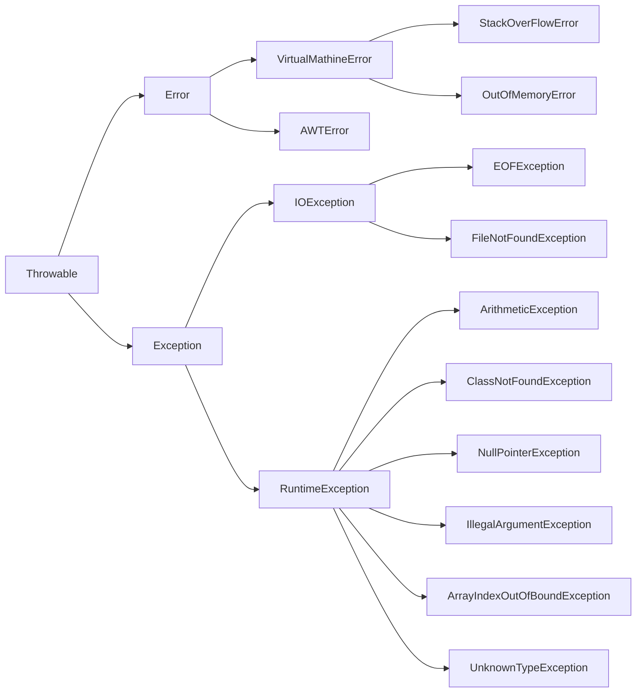
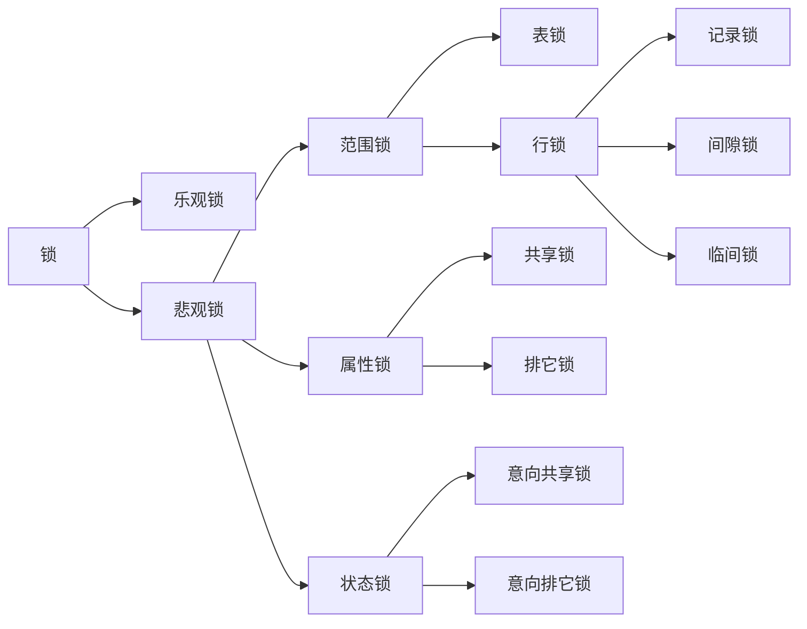

# Java面试题汇总

[TOC]

## Java SE基础

### 面向对象

#### 什么是面向过程与面向对象

面向过程：把问题分解成一个一个步骤，依次按先后顺序执行，最终得到结果

面向对象：把解决一个问题相关的数据和处理这些数据操作封集成到一个对象（object），把相同行为的对象归纳为类(class)，通过类的封闭（encapsulation）隐藏内部细节，通过继承（inheritance）实现类的特化（specialization）/泛化（generalization），通过多态（polymorphism）实现基于对象类型的动态分派（dynamic dispatch）。

#### 面向对象的三个基本特征

面向对象的三个基本特征是：封装、继承、多态

**封装**

定义：封装就是把客观事务封装成抽象的类，并且类可以把自己的数据和方法只让可信的对象操作，对不可信的对象进行信息隐藏。

封装是面向对象的特征之一，是对象和类概念的主要特性。简单地说，一个类就是一个封闭了数据以及操作这些数据的代码的逻辑实体。在一个对象内部，某些代码或某些数据可是私有的，不能被外界访问，通过这种方式，对象对内部数据提供了不同级别的你别

优点：封闭能够灵活地对外隐藏内部信息，使代码模块化，更安全。

**继承**

定义：继承是指这样一种能力，它可以使用现有类的所有功能，并在无需重新编写原来的类的怀着下对这些功能进行扩展。

继承概念的实现方式有二类：实现继承与接口继承。实现继承是批直接使用基类的属性和方法而无需额外的能力；接口继承是批公使用属性和方法的名称、但是子类必须提供实现的能力；

优点：代码的复用

**多态**

定义：所谓多态就是指一个类实例的相同方法在不同情形有不同表现形式。

多态机制使具有不同内部结构的对象可以共享相同的外部接口。这意味着，虽然针对不同对象的具体操作不同，但通过一个公共的类，它们（那些操作）可以通过相同的方式予以调用。
最常见的多态就是将子类传入父类参数中，运行时调用父类方法时通过传入的子类决定具体的内部结构或行为。

优点：接口的复用

#### 面向对象的五大原则

**单一职责原则**（Single-Responsibility Principle）

核心思想：一个类，最好只做一件事，只有一个引起它的变化。

单一职责原则可以看做是低耦合、高内聚在面向对象原则上的引申，将职责定义为引起变化的原因，以提高内聚性来减少引起变化的原因。职责过多，可能引起它变化的原因就越多，这将导致职责依赖，相互之间就产生影响，从而大大损伤其内聚性和耦合度。

开放封闭原则（Open-Closed principle）

核心思想：软件实体应该是可扩展的，而不可修改的。也就是，对扩展开放，对修改封闭的。

开放封闭原则主要体现在两个方面：

- 1、对扩展开放，意味着有新的需求或变化时，可以对现有代码进行扩展，以适应新的情况。
- 2、对修改封闭，意味着类一旦设计完成，就可以独立完成其工作，而不要对其进行任何尝试的修改。 

实现开闭原则的核心思想就是对抽象编程，而不对具体编程，因为抽象相对稳定。让类依赖于固定的抽象，所以修改就是封闭的；而通过面向对象的继承和多态机制，又可以实现对抽象类的继承，通过覆写其方法来改变固有行为，实现新的拓展方法，所以就是开放的。

**Liskov替换原则**（Liskov-Substitution Principle）

核心思想：子类必须能够替换其基类。这一思想体现为对继承机制的约束规范，只有子类能够替换基类时，才能保证系统在运行期内识别子类，这是保证继承复用的基础。

在父类和子类的具体行为中，必须严格把握继承层次中的关系和特征，将基类替换为子类，程序的行为不会发生任何变化。同时，这一约束反过来则是不成立的，子类可以替换基类，但是基类不一定能替换子类。 Liskov替换原则，主要着眼于对抽象和多态建立在继承的基础上，因此只有遵循了Liskov替换原则，才能保证继承复用是可靠地。实现的方法是面向接口编程：将公共部分抽象为基类接口或抽象类，通过Extract Abstract Class，在子类中通过覆写父类的方法实现新的方式支持同样的职责。 Liskov替换原则是关于继承机制的设计原则，违反了Liskov替换原则就必然导致违反开放封闭原则。 Liskov替换原则能够保证系统具有良好的拓展性，同时实现基于多态的抽象机制，能够减少代码冗余，避免运行期的类型判别。

**依赖倒置原则**（Dependency-Inversion Principle）

核心思想：依赖于抽象。具体而言就是高层模块不依赖于底层模块，二者都同依赖于抽象；抽象不依赖于具体，具体依赖于抽象。 

我们知道，依赖一定会存在于类与类、模块与模块之间。当两个模块之间存在紧密的耦合关系时，最好的方法就是分离接口和实现：在依赖之间定义一个抽象的接口使得高层模块调用接口，而底层模块实现接口的定义，以此来有效控制耦合关系，达到依赖于抽象的设计目标。 抽象的稳定性决定了系统的稳定性，因为抽象是不变的，依赖于抽象是面向对象设计的精髓，也是依赖倒置原则的核心。 依赖于抽象是一个通用的原则，而某些时候依赖于细节则是在所难免的，必须权衡在抽象和具体之间的取舍，方法不是一层不变的。依赖于抽象，就是对接口编程，不要对实现编程。

**接口隔离原则**（Interface-Segregation Principle）

其核心思想是：使用多个小的专门的接口，而不要使用一个大的总接口。 具体而言，接口隔离原则体现在：接口应该是内聚的，应该避免“胖”接口。一个类对另外一个类的依赖应该建立在最小的接口上，不要强迫依赖不用的方法，这是一种接口污染。 接口有效地将细节和抽象隔离，体现了对抽象编程的一切好处，接口隔离强调接口的单一性。而胖接口存在明显的弊端，会导致实现的类型必须完全实现接口的所有方法、属性等；而某些时候，实现类型并非需要所有的接口定义，在设计上这是“浪费”，而且在实施上这会带来潜在的问题，对胖接口的修改将导致一连串的客户端程序需要修改，有时候这是一种灾难。在这种情况下，将胖接口分解为多个特点的定制化方法，使得客户端仅仅依赖于它们的实际调用的方法，从而解除了客户端不会依赖于它们不用的方法。 分离的手段主要有以下两种：1、委托分离，通过增加一个新的类型来委托客户的请求，隔离客户和接口的直接依赖，但是会增加系统的开销。2、多重继承分离，通过接口多继承来实现客户的需求，这种方式是较好的。

以上就是5个基本的面向对象设计原则，它们就像面向对象程序设计中的金科玉律，遵守它们可以使我们的代码更加鲜活，易于复用，易于拓展，灵活优雅。不同的设计模式对应不同的需求，而设计原则则代表永恒的灵魂，需要在实践中时时刻刻地遵守。就如ARTHUR J.RIEL在那边《OOD启示录》中所说的：“你并不必严格遵守这些原则，违背它们也不会被处以宗教刑罚。但你应当把这些原则看做警铃，若违背了其中的一条，那么警铃就会响起。”

#### 重写与重载

- **重载**：重载就是函数或者方法有同样的名称，但是参数列表不相同的情形，这样的同名不同参数的函数期末考方法之间，互相称之为重载函数或者方法。
- **重写**：重写指的是在Java的子类与父类中有两个名称、参数列表都相同的方法的情况。由于他们具有相同的方法签名，所以子类中的新方法将覆盖父类中原有的方法。

#### 重载与重写的区别

| 重载                                                         | 重写                                                         |
| ------------------------------------------------------------ | ------------------------------------------------------------ |
| 编译期的概念                                                 | 进行期的概念                                                 |
| 编译期绑定，即在编译时根据参数变量的类型判断应该调用哪个方法 | 运行时绑定，即在运行的时候根据引用变量所指向的实际对象的类型来调用方法 |

因为在编译期已经确定调用哪个方法，所以重载并不是多态。而重写是多态。重载只是一种语言特性，是一种语法规则，与多态无关，与面向对象也无关。（注：严格来说，重载是编译时多态，即静态多态。但是，Java中提到的多态，在不特别说明的情况下都指动态多态）。

#### 重写与重载的条件

| 重载                                       | 重写                                                         |
| ------------------------------------------ | ------------------------------------------------------------ |
| 被重载的方法必须改变参数列表               | 参数列表必须完全与被重写方法的相同                           |
| 被重载的方法可以改变返回类型               | 返回类型必须完全与被重写方法的返回类型相同                   |
| 被重载的方法可以改变访问修饰符             | 访问级别的限制性一定不能比被重写方法的强                     |
| 方法能够在同一个类中或者在一个子类中被重载 | 重写方法一定不能抛出新的检查异常或比被重写的方法声明的检查异常更广泛的检查异常 |
| 被重载的方法可以声明新的或更广的检查异常   | 重写的方法能够抛出更少或更有限的异常（也就是说，被重写的方法声明了异常，但重写的方法可以什么也不声明） |
| 方法能够在同一个类中或者在一个子类中被重载 | 如果不能继承一个方法，则不能重写这个方法                     |
| 与是否为 final 无关                        | 不能重写被标示为final的方法                                  |

#### 面向对象的复用技术

本节主要介绍组合和继承的概念及区别，并分析在写代码时如何进行选择。

**继承**

继承（Inheritance）是一种联结类与类的层次模型。指的是一个类（称为子类、子接口）继承另外的一个类（称为父类、你接口）的功能，并可以增加它自己的新功能的能力，继承 是类与类或者接口与接口之间最常见的郑敏继承是一种 *is a* 关系。

**组合**

组合（Composition）体现的是整体与部分、拥有的关系，即 has-a 的关系。

继承要慎用，其使用场合仅限于你确信使用该技术有效的情况。一个判断方法是，问一问自己是否需要从新类向基类进行向上转型。如果是必须的，则继承是必要的。反之则应该好好考虑是否需要继承。--《Java编程思想》

只有当子类真正是超类的子类型时，才适合用继承。换句话说，对于两个类A和B，只有当两者之间确实存在is-a关系的时候，类B才应该继承类A。--《Effective Java》

#### 组合的优点

1. 不破坏封装，整体类与局部类之间松耦合，彼此相对独立

2. 具有较好的可扩展性
3. 支持动态组合。在运行时，整体对象可以选择不同类型的局部对象
4. 整体类可以对局部类进行包装，封装局部类的接口，提供新的接口
5. 整体类不能自动获得和局部类同样的接口
6. 创建整体类的对象时，需要创建所有局部类的对象

### 数据类型

#### Java中的八个基本类型

char, boolean, byte, short, int, long, float, double

#### Java 中基本类型的取值范围

| 类型  | 最小值          | 最大值             |
| ----- | :-------------- | ------------------ |
| byte  | -2<sup>7</sup>  | 2<sup>7</sup> - 1  |
| short | -2<sup>16</sup> | 2<sup>16</sup> - 1 |
| int   | -2<sup>31</sup> | 2<sup>31</sup> - 1 |
| long  | -2<sup>64</sup> | 2<sup>64</sup> - 1 |

#### Java中的参数传递方式

形式参数与实际参数：

- **形式参数**：是在定义函数名和函数体的时候使用的参数，目的是用来接收调用该函数时传入的参数。
- **实际参数**：在调用有参函数时，主调函数和被调函数之间有数据传递关系。在主调函数中调用一个函数时，函数名后面括号中的参数称为“实际参数”。

值传递与引用传递：

- **值传递**（pass by value）：是指在调用函数时将实际参数复制一份传递到函数中，这样在函数中如果对参数进行修改，将不会影响到实际参数。
- **引用传递**（pass by value）：是指的调用函数时将实际参数的地址直接传递到函数中，那么在函数中对参数所进行的修改，将影响到实际参数。

在Java中，当传递的参数是基本类型时，传递的是基本类型参数的值的拷贝。当传递的参数是对象类型时，传递的是对象类型参数的引用的拷贝。所以在被调用的函数中，当形参本身被重新赋值时不会影响实际参数，若修改对象类型的形参时，所作修改会影响到实参。

**建议在同样可行的情况下，优先使用组合而不是继承。**因为组合更安全，更简单，更灵活，更高效。

#### 类变量、成员变量和局部变量

Java中共有有三种变量，分别是类变量、成员变量和局部变量。他们分别存放在JVM的方法区、堆内存和栈内存中。

```java
    public class Variable {
        private static int a;
        private static b;
        public void test(int c) {
            int d;
        }
    }
```

上面例子中，a是类变量，b是成员变量，c和d是局部变量。

#### Java中的基本数据类型和自动装箱

基本类型，或者叫做内置类型，是Java中不同于类(Class)的特殊类型。它们是我们编程中使用最频繁的类型。

Java是一种强类型语言，第一次申明变量必须说明数据类型，第一次变量赋值称为变量的初始化。

Java基本类型共有八种，基本类型可以分为三类：

> 字符类型char
>
> 布尔类型boolean
>
> 数值类型byte、short、int、long、float、double。

数值类型又可以分为整数类型byte、short、int、long和浮点数类型float、double。

Java中的数值类型不存在无符号的，它们的取值范围是固定的，不会随着机器硬件环境或者操作系统的改变而改变。

实际上，Java中还存在另外一种基本类型void，它也有对应的包装类 java.lang.Void，不过我们无法直接对它们进行操作。

#### 基本数据类型有什么好处

我们都知道在Java语言中，new一个对象是存储在堆里的，我们通过栈中的引用来使用这些对象；所以，对象本身来说是比较消耗资源的。

对于经常用到的类型，如int等，如果我们每次使用这种变量的时候都需要new一个Java对象的话，就会比较笨重。所以，和C++一样，Java提供了基本数据类型，这种数据的变量不需要使用new创建，他们不会在堆上创建，而是直接在栈内存中存储，因此会更加高效。

#### 整型的取值范围

Java中的整型主要包含byte、short、int和long这四种，表示的数字范围也是从小到大的，之所以表示范围不同主要和他们存储数据时所占的字节数有关。

先来个简答的科普，1字节=8位（bit）。java中的整型属于有符号数。

先来看计算中8bit可以表示的数字：

最小值：10000000 （-128）(-2^7)
最大值：01111111（127）(2^7-1)
整型的这几个类型中，

- byte：byte用1个字节来存储，范围为-128(-2^7)到127(2^7-1)，在变量初始化的时候，byte类型的默认值为0。
- short：short用2个字节存储，范围为-32,768 (-2^15)到32,767 (2^15-1)，在变量初始化的时候，short类型的默认值为0，一般情况下，因为Java本身转型的原因，可以直接写为0。
- int：int用4个字节存储，范围为-2,147,483,648 (-2^31)到2,147,483,647 (2^31-1)，在变量初始化的时候，int类型的默认值为0。
- long：long用8个字节存储，范围为-9,223,372,036,854,775,808 (-2^63)到9,223,372,036, 854,775,807 (2^63-1)，在变量初始化的时候，long类型的默认值为0L或0l，也可直接写为0。

#### 超出范围怎么办

上面说过了，整型中，每个类型都有一定的表示范围，但是，在程序中有些计算会导致超出表示范围，即溢出。如以下代码：

```java
    int i = Integer.MAX_VALUE;
    int j = Integer.MAX_VALUE;

    int k = i + j;
    System.out.println("i (" + i + ") + j (" + j + ") = k (" + k + ")");
```

输出结果：i (2147483647) + j (2147483647) = k (-2)

**这就是发生了溢出，溢出的时候并不会抛异常，也没有任何提示。** 所以，在程序中，使用同类型的数据进行运算的时候，一定要注意数据溢出的问题。

#### 包装类型

Java语言是一个面向对象的语言，但是Java中的基本数据类型却是不面向对象的，这在实际使用时存在很多的不便，为了解决这个不足，在设计类时为每个基本数据类型设计了一个对应的类进行代表，这样八个和基本数据类型对应的类统称为包装类(Wrapper Class)。

包装类均位于 `java.lang` 包，包装类和基本数据类型的对应关系如下表所示

| 基本数据类型 | 包装类    |
| ------------ | --------- |
| char         | Character |
| boolean      | Boolean   |
| byte         | Byte      |
| short        | Short     |
| int          | Integer   |
| long         | Long      |
| float        | Float     |
| double       | Double    |

在这八个类名中，除了Integer和Character类以后，其它六个类的类名和基本数据类型一致，只是类名的第一个字母大写即可。

#### 为什么需要包装类

很多人会有疑问，既然Java中为了提高效率，提供了八种基本数据类型，为什么还要提供包装类呢？

这个问题，其实前面已经有了答案，因为Java是一种面向对象语言，很多地方都需要使用对象而不是基本数据类型。比如，在集合类中，我们是无法将int 、double等类型放进去的。因为集合的容器要求元素是Object类型。

为了让基本类型也具有对象的特征，就出现了包装类型，它相当于将基本类型“包装起来”，使得它具有了对象的性质，并且为其添加了属性和方法，丰富了基本类型的操作。

#### 拆箱与装箱

那么，有了基本数据类型和包装类，肯定有些时候要在他们之间进行转换。比如把一个基本数据类型的int转换成一个包装类型的Integer对象。

我们认为包装类是对基本类型的包装，所以，把基本数据类型转换成包装类的过程就是打包装，英文对应于boxing，中文翻译为装箱。

反之，把包装类转换成基本数据类型的过程就是拆包装，英文对应于unboxing，中文翻译为拆箱。

在Java SE5之前，要进行装箱，可以通过以下代码：

```java
    Integer i = new Integer(10);
```

自动拆箱与自动装箱
在Java SE5中，为了减少开发人员的工作，Java提供了自动拆箱与自动装箱功能。

自动装箱: 就是将基本数据类型自动转换成对应的包装类。

自动拆箱：就是将包装类自动转换成对应的基本数据类型。

```java
    Integer i =10;  //自动装箱
    int b= i;  //自动拆箱
```

Integer i=10 可以替代 Integer i = new Integer(10);，这就是因为Java帮我们提供了自动装箱的功能，不需要开发者手动去new一个Integer对象。

自动装箱与自动拆箱的实现原理
既然Java提供了自动拆装箱的能力，那么，我们就来看一下，到底是什么原理，Java是如何实现的自动拆装箱功能。

我们有以下自动拆装箱的代码：

```java
    public static  void main(String[]args){
        Integer integer=1; //装箱
        int i=integer; //拆箱
    }
```

对以上代码进行反编译后可以得到以下代码：

```java
    public static  void main(String[]args){
        Integer integer=Integer.valueOf(1);
        int i=integer.intValue();
    }
```

从上面反编译后的代码可以看出，int的自动装箱都是通过Integer.valueOf()方法来实现的，Integer的自动拆箱都是通过integer.intValue来实现的。如果读者感兴趣，可以试着将八种类型都反编译一遍 ，你会发现以下规律：

自动装箱都是通过包装类的valueOf()方法来实现的.自动拆箱都是通过包装类对象的xxxValue()来实现的。

#### 哪些地方会自动拆装箱

我们了解过原理之后，在来看一下，什么情况下，Java会帮我们进行自动拆装箱。前面提到的变量的初始化和赋值的场景就不介绍了，那是最简单的也最容易理解的。

我们主要来看一下，那些可能被忽略的场景。

场景一、将基本数据类型放入集合类
我们知道，Java中的集合类只能接收对象类型，那么以下代码为什么会不报错呢？

```java
    List<Integer> li = new ArrayList<>();
    for (int i = 1; i < 50; i ++){
        li.add(i);
    }
```

将上面代码进行反编译，可以得到以下代码：

```java
    List<Integer> li = new ArrayList<>();
    for (int i = 1; i < 50; i += 2){
        li.add(Integer.valueOf(i));
    }
```

以上，我们可以得出结论，当我们把基本数据类型放入集合类中的时候，会进行自动装箱。

场景二、包装类型和基本类型的大小比较
有没有人想过，当我们对Integer对象与基本类型进行大小比较的时候，实际上比较的是什么内容呢？看以下代码：

```java
    Integer a=1;
    System.out.println(a==1?"等于":"不等于");
    Boolean bool=false;
    System.out.println(bool?"真":"假");
```

对以上代码进行反编译，得到以下代码：

```java
    Integer a=1;
    System.out.println(a.intValue()==1?"等于":"不等于");
    Boolean bool=false;
    System.out.println(bool.booleanValue?"真":"假");
```

可以看到，包装类与基本数据类型进行比较运算，是先将包装类进行拆箱成基本数据类型，然后进行比较的。

场景三、包装类型的运算
有没有人想过，当我们对Integer对象进行四则运算的时候，是如何进行的呢？看以下代码：

```java
    Integer i = 10;
    Integer j = 20;

    System.out.println(i+j);
```

反编译后代码如下：

```java
    Integer i = Integer.valueOf(10);
    Integer j = Integer.valueOf(20);
    System.out.println(i.intValue() + j.intValue());
```

我们发现，两个包装类型之间的运算，会被自动拆箱成基本类型进行。

场景四、三目运算符的使用
这是很多人不知道的一个场景，作者也是一次线上的血淋淋的Bug发生后才了解到的一种案例。看一个简单的三目运算符的代码：

```java
    boolean flag = true;
    Integer i = 0;
    int j = 1;
    int k = flag ? i : j;
```

很多人不知道，其实在int k = flag ? i : j;这一行，会发生自动拆箱。反编译后代码如下：

```java
    boolean flag = true;
    Integer i = Integer.valueOf(0);
    int j = 1;
    int k = flag ? i.intValue() : j;
    System.out.println(k);
```

这其实是三目运算符的语法规范。当第二，第三位操作数分别为基本类型和对象时，其中的对象就会拆箱为基本类型进行操作。

因为例子中，flag ? i : j;片段中，第二段的i是一个包装类型的对象，而第三段的j是一个基本类型，所以会对包装类进行自动拆箱。如果这个时候i的值为null，那么就会发生NPE。（自动拆箱导致空指针异常）

场景五、函数参数与返回值
这个比较容易理解，直接上代码了：

```java
    //自动拆箱
    public int getNum1(Integer num) {
     return num;
    }
    //自动装箱
    public Integer getNum2(int num) {
     return num;
    }
```

自动拆装箱与缓存
Java SE的自动拆装箱还提供了一个和缓存有关的功能，我们先来看以下代码，猜测一下输出结果：

```java
public static void main(String... strings) {

    Integer integer1 = 3;
    Integer integer2 = 3;

    if (integer1 == integer2)
        System.out.println("integer1 == integer2");
    else
        System.out.println("integer1 != integer2");

    Integer integer3 = 300;
    Integer integer4 = 300;

    if (integer3 == integer4)
        System.out.println("integer3 == integer4");
    else
        System.out.println("integer3 != integer4");
}
```

我们普遍认为上面的两个判断的结果都是false。虽然比较的值是相等的，但是由于比较的是对象，而对象的引用不一样，所以会认为两个if判断都是false的。在Java中，==比较的是对象应用，而equals比较的是值。所以，在这个例子中，不同的对象有不同的引用，所以在进行比较的时候都将返回false。奇怪的是，这里两个类似的if条件判断返回不同的布尔值。

上面这段代码真正的输出结果：

```java
integer1 == integer2
integer3 != integer4
```

原因就和Integer中的缓存机制有关。在Java 5中，在Integer的操作上引入了一个新功能来节省内存和提高性能。整型对象通过使用相同的对象引用实现了缓存和重用。

适用于整数值区间-128 至 +127。

只适用于自动装箱。使用构造函数创建对象不适用。

具体的代码实现可以阅读Java中整型的缓存机制一文，这里不再阐述。

我们只需要知道，当需要进行自动装箱时，如果数字在-128至127之间时，会直接使用缓存中的对象，而不是重新创建一个对象。

其中的javadoc详细的说明了缓存支持-128到127之间的自动装箱过程。最大值127可以通过-XX:AutoBoxCacheMax=size修改。

实际上这个功能在Java 5中引入的时候,范围是固定的-128 至 +127。后来在Java 6中，可以通过java.lang.Integer.IntegerCache.high设置最大值。

这使我们可以根据应用程序的实际情况灵活地调整来提高性能。到底是什么原因选择这个-128到127范围呢？因为这个范围的数字是最被广泛使用的。 在程序中，第一次使用Integer的时候也需要一定的额外时间来初始化这个缓存。

在Boxing Conversion部分的Java语言规范(JLS)规定如下：

如果一个变量p的值是：

-128至127之间的整数(§3.10.1)

true 和 false的布尔值 (§3.10.3)

‘\u0000’至 ‘\u007f’之间的字符(§3.10.4)
范围内的时，将p包装成a和b两个对象时，可以直接使用a==b判断a和b的值是否相等。

#### 自动拆装箱带来的问题

当然，自动拆装箱是一个很好的功能，大大节省了开发人员的精力，不再需要关心到底什么时候需要拆装箱。但是，他也会引入一些问题。

包装对象的数值比较，不能简单的使用==，虽然-128到127之间的数字可以，但是这个范围之外还是需要使用equals比较。

前面提到，有些场景会进行自动拆装箱，同时也说过，由于自动拆箱，如果包装类对象为null，那么自动拆箱时就有可能抛出NPE。

如果一个for循环中有大量拆装箱操作，会浪费很多资源。

#### Java中的Integer缓存

本文将介绍Java中Integer的缓存相关知识。这是在Java 5中引入的一个有助于节省内存、提高性能的功能。首先看一个使用Integer的示例代码，从中学习其缓存行为。接着我们将为什么这么实现以及他到底是如何实现的。你能猜出下面的Java程序的输出结果吗。如果你的结果和真正结果不一样，那么你就要好好看看本文了。

```java
package com.javapapers.java;

public class JavaIntegerCache {
    public static void main(String... strings) {

        Integer integer1 = 3;
        Integer integer2 = 3;

        if (integer1 == integer2)
            System.out.println("integer1 == integer2");
        else
            System.out.println("integer1 != integer2");

        Integer integer3 = 300;
        Integer integer4 = 300;

        if (integer3 == integer4)
            System.out.println("integer3 == integer4");
        else
            System.out.println("integer3 != integer4");
    }
}
```

我们普遍认为上面的两个判断的结果都是false。虽然比较的值是相等的，但是由于比较的是对象，而对象的引用不一样，所以会认为两个if判断都是false的。在Java中，==比较的是对象应用，而equals比较的是值。所以，在这个例子中，不同的对象有不同的引用，所以在进行比较的时候都将返回false。奇怪的是，这里两个类似的if条件判断返回不同的布尔值。

上面这段代码真正的输出结果：

```java
integer1 == integer2
integer3 != integer4
```

#### Java中Integer的缓存实现

在Java 5中，在Integer的操作上引入了一个新功能来节省内存和提高性能。整型对象通过使用相同的对象引用实现了缓存和重用。

适用于整数值区间-128 至 +127。

只适用于自动装箱。使用构造函数创建对象不适用。

Java的编译器把基本数据类型自动转换成封装类对象的过程叫做自动装箱，相当于使用valueOf方法：

Integer a = 10; //this is autoboxing
Integer b = Integer.valueOf(10); //under the hood
现在我们知道了这种机制在源码中哪里使用了，那么接下来我们就看看JDK中的valueOf方法。下面是JDK 1.8.0 build 25的实现：

```java
/**
     * Returns an {@code Integer} instance representing the specified
     * {@code int} value.  If a new {@code Integer} instance is not
     * required, this method should generally be used in preference to
     * the constructor {@link #Integer(int)}, as this method is likely
     * to yield significantly better space and time performance by
     * caching frequently requested values.
     *
     * This method will always cache values in the range -128 to 127,
     * inclusive, and may cache other values outside of this range.
     *
     * @param  i an {@code int} value.
     * @return an {@code Integer} instance representing {@code i}.
     * @since  1.5
     */
    public static Integer valueOf(int i) {
        if (i >= IntegerCache.low && i <= IntegerCache.high)
            return IntegerCache.cache[i + (-IntegerCache.low)];
        return new Integer(i);
    }
```

在创建对象之前先从IntegerCache.cache中寻找。如果没找到才使用new新建对象。

#### IntegerCache Class

IntegerCache是Integer类中定义的一个private static的内部类。接下来看看他的定义。

```java
  /**
     * Cache to support the object identity semantics of autoboxing for values between
     * -128 and 127 (inclusive) as required by JLS.
     *
     * The cache is initialized on first usage.  The size of the cache
     * may be controlled by the {@code -XX:AutoBoxCacheMax=} option.
     * During VM initialization, java.lang.Integer.IntegerCache.high property
     * may be set and saved in the private system properties in the
     * sun.misc.VM class.
     */

    private static class IntegerCache {
        static final int low = -128;
        static final int high;
        static final Integer cache[];

        static {
            // high value may be configured by property
            int h = 127;
            String integerCacheHighPropValue =
                sun.misc.VM.getSavedProperty("java.lang.Integer.IntegerCache.high");
            if (integerCacheHighPropValue != null) {
                try {
                    int i = parseInt(integerCacheHighPropValue);
                    i = Math.max(i, 127);
                    // Maximum array size is Integer.MAX_VALUE
                    h = Math.min(i, Integer.MAX_VALUE - (-low) -1);
                } catch( NumberFormatException nfe) {
                    // If the property cannot be parsed into an int, ignore it.
                }
            }
            high = h;

            cache = new Integer[(high - low) + 1];
            int j = low;
            for(int k = 0; k < cache.length; k++)
                cache[k] = new Integer(j++);

            // range [-128, 127] must be interned (JLS7 5.1.7)
            assert IntegerCache.high >= 127;
        }

        private IntegerCache() {}
    }
```

其中的javadoc详细的说明了缓存支持-128到127之间的自动装箱过程。最大值127可以通过-XX:AutoBoxCacheMax=size修改。 缓存通过一个for循环实现。从低到高并创建尽可能多的整数并存储在一个整数数组中。这个缓存会在Integer类第一次被使用的时候被初始化出来。以后，就可以使用缓存中包含的实例对象，而不是创建一个新的实例(在自动装箱的情况下)。

实际上这个功能在Java 5中引入的时候,范围是固定的-128 至 +127。后来在Java 6中，可以通过`java.lang.Integer.IntegerCache.high` 设置最大值。这使我们可以根据应用程序的实际情况灵活地调整来提高性能。到底是什么原因选择这个-128到127范围呢？因为这个范围的数字是最被广泛使用的。 在程序中，第一次使用Integer的时候也需要一定的额外时间来初始化这个缓存。

#### Java语言规范中的缓存行为

在Boxing Conversion部分的Java语言规范(JLS)规定如下：

如果一个变量p的值是：

-128至127之间的整数(§3.10.1)

true 和 false的布尔值 (§3.10.3)

‘\u0000’至 ‘\u007f’之间的字符(§3.10.4)

中时，将p包装成a和b两个对象时，可以直接使用a==b判断a和b的值是否相等。

#### 其他缓存的对象

这种缓存行为不仅适用于Integer对象。我们针对所有的整数类型的类都有类似的缓存机制。

有ByteCache用于缓存Byte对象

有ShortCache用于缓存Short对象

有LongCache用于缓存Long对象

有CharacterCache用于缓存Character对象

`Byte`, `Short`, `Long` 有固定范围: -128 到 127。对于Character, 范围是 0 到 127。除了Integer以外，这个范围都不能改变。

#### & 和 &&， | 和 || 的区别

&：逻辑与（and），运算符两边的表达式均为 true 时，整个结果才为 true

&&：短路与，如果第一个表达式为 false 时，第二个表达式就不会计算了

#### == 和 equals 有什么区别

==：如果比较的是基本变量，比较的是变量的值是否相等。如果比较的是引用变量，比较的是变量的地址是否相同（是否为同一个对象）

equals：Object 的方法，默认比较 两个变量的地址是否相同

#### 什么是不可变对象

如果一个对象在创建之后就不能再改变它的状态，那么这个对象就是不可变的（Immutable）。不能改变状态的意思是，不能改变对象内的成员变量，包括基本数据类型变量的值不能改变，引用类型的变量不能指向其他的对象，引用类型指向的对象的状态也不能改变。

#### final关键字的作用

如果要创建一个不可变的变量，关键一步就是要将所有的成员变量声明为 final 类型。

- final 修饰类，表示该类不能被继承
- final 修饰方法，表示子类不可重写该方法
- final 修饰基本数据类型变量，表示该变量为常量，值不能再修改
- final 修饰引用类型变量，表示该引用在构造对象之后不能指向其他的对象，但该引用指向的对象的状态可以改变。

#### String str = new String(“abc”); 创建了几个 String 对象？

如果 String 常量池（常量缓冲区）中已经创建“abc”，则不会继续创建，此时只创建了一个对象 new String("abc");

如果 String 常量池中没有创建“abc”，则会创建两个对象，一个对象的值是“abc”，一个对象 new String("abc");

#### HashMap 和 Hashtable 的区别？

HashMap：实现了 Map 接口，允许空（null）键值（key），由于非线程安全，在只有一个线程访问的情况下，效率高于Hashtable。

Hashtable：不能将 null 作为 key 或者 value。方法是同步的，线程安全。

#### Java 中创建对象的方式有哪些？

- 1、使用 new 关键字
- 2、使用反射机制创建对象
- 3、`java.lang.reflect.Constructor`类里也有一个 newInstance 方法可以创建对象。
- 4、使用 clone 方法，先实现 Cloneable 接口并实现其定义的 clone 方法。

#### Java中的方法覆盖（Overriding）和方法重载（Overloading）是什么意思

Java中的方法重载发生在同一个类里面两个或者是多个方法的方法名相同但是参数不同的情况。与此相对，方法覆盖是说子类重新定义了父类的方法。方法覆盖必须有相同的方法名，参数列表和返回类型。覆盖者可能不会限制它所覆盖的方法的访问。

#### Java中的访问修饰符

| 当前类  | 同一包内 | 子类 | 其他包 |
| ------- | -------- | ---- | ------ |
| public  | ✔        | ✔    | ✔      |
| protect | ✔        | ✔    | ✘      |
| default | ✔        | ✘    | ✘      |
| private | ✘        | ✘    | ✘      |

#### Java 中 switch 支持什么类型的变量

byte, short, int, char, enum, String(JDK7)

### 集合

#### List

Java中的List接口有 `ArrayList`, `LinkedList`, `Vector`几种实现。

这三者都实现了List 接口，使用方式也很相似,主要区别在于因为实现方式的不同,所以对不同的操作具有不同的效率。

ArrayList 是一个可改变大小的数组.当更多的元素加入到ArrayList中时,其大小将会动态地增长.内部的元素可以直接通过get与set方法进行访问,因为ArrayList本质上就是一个数组.

LinkedList 是一个双链表,在添加和删除元素时具有比ArrayList更好的性能.但在get与set方面弱于ArrayList.

当然,这些对比都是指数据量很大或者操作很频繁的情况下的对比,如果数据和运算量很小,那么对比将失去意义.

Vector 和ArrayList类似,但属于强同步类。如果你的程序本身是线程安全的(thread-safe,没有在多个线程之间共享同一个集合/对象),那么使用ArrayList是更好的选择。

Vector和ArrayList在更多元素添加进来时会请求更大的空间。Vector每次请求其大小的双倍空间，而ArrayList每次对size增长50%.

而 LinkedList 还实现了 Queue 接口,该接口比List提供了更多的方法,包括 offer(),peek(),poll()等.

注意: 默认情况下ArrayList的初始容量非常小,所以如果可以预估数据量的话,分配一个较大的初始值属于最佳实践,这样可以减少调整大小的开销。

#### Set是如何确保元素不重复的

在Java的Set体系中，根据实现方式不同主要分为两大类。HashSet和TreeSet。

1、TreeSet 是二叉树实现的,Treeset中的数据是自动排好序的，不允许放入null值 2、HashSet 是哈希表实现的,HashSet中的数据是无序的，可以放入null，但只能放入一个null，两者中的值都不能重复，就如数据库中唯一约束

在HashSet中，基本的操作都是有HashMap底层实现的，因为HashSet底层是用HashMap存储数据的。当向HashSet中添加元素的时候，首先计算元素的hashcode值，然后通过扰动计算和按位与的方式计算出这个元素的存储位置，如果这个位置位空，就将元素添加进去；如果不为空，则用equals方法比较元素是否相等，相等就不添加，否则找一个空位添加。

TreeSet的底层是TreeMap的keySet()，而TreeMap是基于红黑树实现的，红黑树是一种平衡二叉查找树，它能保证任何一个节点的左右子树的高度差不会超过较矮的那棵的一倍。

TreeMap是按key排序的，元素在插入TreeSet时compareTo()方法要被调用，所以TreeSet中的元素要实现Comparable接口。TreeSet作为一种Set，它不允许出现重复元素。TreeSet是用compareTo()来判断重复元素的。

#### Java 中的异常的分类

**Java异常类层次结构图**



- **运行时异常**：都是`RuntimeException`类及其子类异常，如`NullPointerException`(空指针异常)、`IndexOutOfBoundsException`(下标越界异常)等，这些异常是**不检查异常**，程序中可以选择捕获处理，也可以不处理。这些异常一般是**由程序逻辑错误引起**的，程序应该从逻辑角度尽可能避免这类异常的发生。
  运行时异常的特点是Java编译器不会检查它，也就是说，当程序中可能出现这类异常，即使没有用`try-catch`语句捕获它，也没有用`throws`子句声明抛出它，也会编译通过。
- **非运行时异常 （编译异常）**：是`RuntimeException`以外的异常，类型上都属于`Exception`类及其子类。从程序语法角度讲是必须进行处理的异常，如果**不处理，程序就不能编译通过**。如`IOException`、`SQLException`等以及用户自定义的Exception异常，一般情况下不自定义检查异常。
  在 Java 中，所有的异常都有一个共同的祖先 `Throwable`（可抛出）。`Throwable` 指定代码中可用异常传播机制通过 Java 应用程序传输的任何问题的共性。
  `Throwable`： 有两个重要的子类：`Exception`（异常）和 `Error`（错误），二者都是 Java 异常处理的重要子类，各自都包含大量子类。
- `Error`（错误）:是程序无法处理的错误，表示运行应用程序中较严重问题。大多数错误与代码编写者执行的操作无关，而表示代码运行时 JVM（Java 虚拟机）出现的问题。例如，Java虚拟机运行错误（Virtual MachineError），当 JVM 不再有继续执行操作所需的内存资源时，将出现 `OutOfMemoryError`。这些异常发生时，Java虚拟机（JVM）一般会选择线程终止。
  。这些错误表示故障发生于虚拟机自身、或者发生在虚拟机试图执行应用时，如Java虚拟机运行错误（Virtual MachineError）、类定义错误（`NoClassDefFoundError`）等。这些错误是不可查的，因为它们在应用程序的控制和处理能力之 外，而且绝大多数是程序运行时不允许出现的状况。对于设计合理的应用程序来说，即使确实发生了错误，本质上也不应该试图去处理它所引起的异常状况。在 Java中，错误通过Error的子类描述。
- Exception（异常）:是程序本身可以处理的异常。`Exception` 类有一个重要的子类 RuntimeException。RuntimeException 类及其子类表示“JVM 常用操作”引发的错误。例如，若试图使用空值对象引用、除数为零或数组越界，则分别引发运行时异常（`NullPointerException`、`ArithmeticException`）和 `ArrayIndexOutOfBoundException`。

注意：**异常和错误的区别：异常能被程序本身可以处理，错误是无法处理。**

- 通常，Java的异常(包括 `Exception` 和 `Error` )分为可查的异常（checked exceptions）和不可查的异常（unchecked exceptions）。
- 可查异常（编译器要求必须处置的异常）：正确的程序在运行中，很容易出现的、情理可容的异常状况。可查异常虽然是异常状况，但在一定程度上它的发生是可以预计的，而且一旦发生这种异常状况，就必须采取某种方式进行处理。
- 除了 `RuntimeException` 及其子类以外，其他的 `Exception` 类及其子类都属于可查异常。这种异常的特点是Java编译器会检查它，也就是说，当程序中可能出现这类异常，要么用try-catch语句捕获它，要么用throws子句声明抛出它，否则编译不会通过。
- 不可查异常(编译器不要求强制处置的异常):包括运行时异常（`RuntimeException`与其子类）和错误（`Error`）。
- `Exception` 这种异常分两大类运行时异常和非运行时异常(编译异常)。程序中应当尽可能去处理这些异常。

#### 一个线程运行时发生异常会怎样？

如果异常没有被捕获该线程将会停止执行。Thread.UncaughtExceptionHandler是用于处理未捕获异常造成线程突然中断情况的一个内嵌接口。当一个未捕获异常将造成线程中断的时候JVM会使用Thread.getUncaughtExceptionHandler()来查询线程的UncaughtExceptionHandler并将线程和异常作为参数传递给handler的uncaughtException()方法进行处理。

### 线程

#### 什么是线程？

线程是操作系统能够进行运算调度的最小单位，它被包含在进程之中，是进程中的实际运作单位。程序员可以通过它进行多处理器编程，你可以使用多线程对运算密集型任务提速。

#### 线程和进程有什么区别？

一个进程是一个独立（self contained）的运行环境，它可以被看作一个程序或者一个应用。而线程是在进程中执行的一个任务。线程是进程的子集，一个进程可以有多个线程，每条线程并行执行不同的任务。**不同的进程使用不同的内存空间，而所有的线程共享一片相同的内存空间。**不能把它和栈内存搞混了，每个线程都拥有单独的内存用来存储本地数据。

#### 什么是临界区和竞态条件

竞态条件是在临界区内可能发生的一种特殊情况。临界区是多线程并发执行一代码，根据线程的执行顺序可能产生多种结果的区域。多线程在临界区执行代码的结果可能不一样，不同的结果取决于线程的执行顺序。也就是说，临界区包含竞态条件。竞态一词源于隐喻，线程在临界区进进行资源竞争，在临界区的资源竞争影响最后的结果。

#### 什么是线程安全？

代码所在的进程中有多个线程在同时运行，而这些线程可能会同时运行这段代码。如果每次运行结果和单线程运行的结果是一样的，而且其他的变量的值也和预期一样，就是线程安全的。一个线程安全的计数器类的同一个实例对象在被 多个线程使用的情况下也不会出现计算失误。

#### 一个线程运行时发生异常会怎样？

如果异常没有被捕获该线程将会停止执行。Thread.UncaughtExceptionHandler 是用于处理未捕获异常造成线程突然中断情况的一个内嵌接口。当一个未捕获 异常将造成线程中断的时候 JVM 会使用 Thread.getUncaughtExceptionHandler() 来查询线程的 UncaughtExceptionHandler 并将线程和异常作为参数传递给 handler 的 uncaughtException() 方法进行处理。

#### 如何在两个线程间共享数据？

你可以通过共享对象来实现这个目的，或者是使用像阻塞队列这样并发的数据结构。

#### 什么是 FutureTask？

在 Java 并发程序中，FutureTask表示一个可以取消的异步运算。它有启动和取消运算、查询运算是否完成和取回运算结果等方法。只有当运算完成的时候结果才能取回，如果运算尚未不完成，get() 方法将会阻塞。一个 FutureTask 对象可以对调用了 Callable 和 Runnable 的对象进行包装，由于 FutureTask也是调用了 Runnable 接口，所以提交给 Executor 来执行。

#### 什么是线程池？它的优点是什么？

创建线程要花费昂贵的资源和时间，如果任务来了才创建线程那么响应时间会变长，而且一个进程能创建的线程数有限。为了避免这些问题，在程序启动的时候就创建若干线程来响应处理，它们被称为线程池，里面的线程叫工作线程。从 JDK1.5 开始，Java API 提供了 Executor 框架让你可以创建不同的线程池。比如单线程池，每次处理一个任务；数目固定的线程池或者是缓存线程池（一个适合很多生存期短的任务的程序的可扩展线程池）。

#### 如何写代码来解决生产都消费者问题？

在现实中你解决的许多线程问题都属于生产者消费者模型，就是一个线程生产任务代其它线程进行消费，你必须知道怎么进行线程间通信来解决这个问题。比较低级的办法是用 wait() 和 notify() 来解决这个问题，比较赞的办法是用 Semaphore 或者 BlockingQueue 来实现生产者消费者模型。

#### 什么是死锁？

死锁是指两个或两个以上的进程在执行过程中，由于竞争资源或者由于彼此通信而造成的一种阻塞的现象，若无外力作用，它们都将无法推进下去。此时称系统处于*死锁*状态或系统产生了死锁，这些永远在互相等待的进程称为死锁进程。死锁发生的条件

1. 互斥条件：一个资源每次只能被一个进程使用
2. 请求与保持条件：一个进程因请求资源而阻塞时，对已获得的资源保持不放。
3. 不剥夺条件：进程已获得的资源，在未使用完之前，不能强行剥夺。
4. 循环等待条件：若干进程之间形成一种头尾相接的循环等待资源关系

避免死锁最简单的方法就是阻止循环等待条件，将系统中所有的资源设置标志位、排序，规定所有的线程申请资源必须以一定的顺序（升序或降序）做操作来避免死锁。

#### Java 中 notify 和 notifyAll 有什么区别？

这又是一个刁钻的问题，因为多线程可以等待单监控锁，Java API 的设计人员撮合了一些方法当等待锚固件改变的时候通知它们，但是这些方法没有完全实现。notify() 方法不能唤醒七个具体的线程，所以只有一个线程在等待的时候它都有用武之地。而 notifyAll() 唤醒所有线程并允许它们争夺锁确保了至少有一个线程能继续运行。

#### 为什么 wait()，notify() 和 notifyAll() 这些方法在 Object 中？

Java 提供的锁是对象级的而不是线程级的，每个对象都有锁，通过线程获得。如果线程需要等待某些锁，那么调用对象中的 wait() 方法就有意义 了。如果 wait() 方法定义在 Thread 类中，线程正在等待的是哪个锁就不明显了。简单的说，由于 wait，notify 和 notifyAll 都是锁级别的操作，所以把它们定义在 Object 类中因为锁属于对象。

#### 为什么 wait() 和 notify() 方法要在同步块中调用？

wait() 方法做了两件事，一是释放锁，二是使当前线程处于等待状态。若要释放锁先要获取锁，在同步块中是持有锁的状态，因此要在同步块中执行 wait()。

notify() 方法通知持有当前锁时 wait() 的线程继续执行，因此也需要先获取锁。

#### 为什么 wait 和 notify 方法要在同步代码块中调用？

当一个线程需要调用对象的 wait() 方法的时候，这个线程必须拥有该对象的锁，接着它就 会释放这个 对象锁并进入等待状态直到其他线程调用这个对象上的 notify() 方法。同样的，当一个线程需要调用对象的 notify() 方法时，它会释放这个对象的锁，以便其他在等待的线程就可以得到这个对象锁。由于所有的这些方法都需要线程持有对象的锁，这样就只能通过同步来实现，所以他们只能在同步方法或者同步块中被调用。如果不这么做，代码会抛出 IllegalMonitorStateException 异常。

### Java 虚拟机

#### Java虚拟机运行时的数据区

**Java 虚拟机运行时内存图**


在JDK1.8之前，JVM 运行时数据区分为程序计数器、堆、虚拟机栈、本地方法栈、方法区、运行时常量池、直接内存。

**程序计数器**

线程私有，此内存区域是唯一一个在Java虚拟机规范中没有规定任何 `OutOfMemoryError` 情况的区域

- 如果线程正在执行的是Java 方法，则这个计数器记录的是正在执行的虚拟机字节码指令地址
- 如果正在执行的是Native 方法，则这个计数器值为空（Undefined）

**虚拟机栈**

线程私有，每个栈帧对应一次方法调用。

栈帧中存放了局部变量表（基本数据类型变量和对象引用）、操作数栈、方法出口等信息。当栈的深度超过 JVM 所允许的范围，就会抛出 `StackOverflowError` 的错误。

**本地方法栈**

线程私有，主要与虚拟机用到的 Native 方法相关。

**方法区**

线程共享，存放已加载类的信息（包括类的字节码，类的结构）、常量、静态变量等。

**堆**

堆中存放的是对象（包括数组）。当申请不到空间时会抛出OutOfMemoryError。

#### HotSpot 虚拟机的方法区在 JDK7 中有何变化，为什么做这些变化？

- 符号引用（Symbols）转移到了 native heap。
- 字面量（interned strings）转移到了 java heap。
- 类的静态变量（class statics）转移到了 java heap。

#### JDK8 中的元空间

在JDK8中，永久代已经不存在，类信息、编译后的代码数据等已经移动到MetaSpace（元空间）中，元空间不在堆内存中，直接中用本地内存（NativeMemory）。元空间和永久代的本质类似，都是对JVM规范中方法区的实现。  

JDK9 中的永久代被元空间替换，有如下原因：

- 永久代由 MaxPermSize 控制，而永久区由系统的实际可用空间来控制，后者不容易出现内存溢出问题。
- Oracle 后期有可能 将 HotSpot 和 JRockit 两种虚拟机代码合并，JRockit 中没有永久代但运行良好

#### PermGen（永久代）

“方法区”是JVM的规范，而“永久代”是方法区的一种实现，并且只有HotSpot才有“PermGen space”，而对于其他类型的虚拟机并没有“PermGen space”。

#### 堆内存划分

在JDK7及之前的JDK版本中，堆内存通常被分为三块区域：Young Generation（年轻代）、Old Generation（年老代）、Permanent Generation for VM Matedata（永久代）。  

#### 简述类加载器的双亲委派模型

对于任意一个类，都需要由加载它的类加载器和这个类本身来一同确立其在 Java 虚拟机中的唯一性。我们通常采用 equals() 方法，isInstance() 方法和 isAssignableFrom() 方法。来判断，对于同一个路径下的类，如果没有采用相同的类加载器来加载，则 JVM 会认为它们是不相等的。

**双亲委派**：如果一个类加载器收到了加载某个类的请求,则该类加载器并不会去加载该类,而是把这个请求委派给父类加载器,每一个层次的类加载器都是如此,因此所有的类加载请求最终都会传送到顶端的启动类加载器;只有当父类加载器在其搜索范围内无法找到所需的类,并将该结果反馈给子类加载器,子类加载器会尝试去自己加载。

执行加载的流程如下：

1. 子类先委托父类加载
2. 父类加载器有自己的**加载范围**，范围内没有找到，则不加载，并返回给子类
3. 子类在收到父类无法加载的时候，才会自己去加载

JVM 提供了三种系统加载器：

1. 启动类加载器（Bootstrap ClassLoader）：C++实现，在java里无法获取，**负责加载/lib**下的类。
2. 扩展类加载器（Extension ClassLoader）： Java实现，可以在java里获取，**负责加载/lib/ext**下的类。
3. 系统类加载器/应用程序类加载器（Application ClassLoader）：是与我们接触对多的类加载器，我们写的代码默认就是由它来加载，ClassLoader.getSystemClassLoader返回的就是它。

#### 为什么要破坏双亲委派模型？

因为在某些情况下父类加载器需要委托子类加载器去加载 class 文件。受到加载范围的限制，父类加载器无法加载到需要的文件，以 Driver 接口为例，由于 Driver 接口定义在  JDK 当中的，而其实现由各个数据库的服务商来提供，比如 mysql 的就写了 `MySQL Connector`，那么问题就来了， DriverManager（也由jdk提供）要加载各个实现了 Driver 接口的实现类，然后进行管理，但是 DriverManager 由启动类加载器加载，只能记载 JAVA_HOME 的 lib 下文件，而其实现是由服务商提供的，由系统类加载器加载，这个时候就需要启动类加载器来委托子类来加载 Driver 实现，从而破坏了双亲委派，这里仅仅是举了破坏双亲委派的其中一个情况。

#### 运行时的栈帧的数据结构

栈帧(Stack Frame)是用于支持虚拟机进行方法调用和方法执行的数据结构，它是虚拟机运行时数据区的虚拟机栈(Virtual Machine Stack)的栈元素。栈帧存储了方法的**局部变量表，操作数栈，动态连接和方法返回地址**等信息。第一个方法从调用开始到执行完成，就对应着一个栈帧在虚拟机栈中从入栈到出栈的过程。

#### 局部变量表

局部变量表是一组变量值存储空间，用于存放方法参数和方法内部定义的局部变量。

## 数据库

### 数据库基础

#### 什么是主键、外键、超键和候选键

**超键**：在关系中能唯一标识元组的属性集称为关系模式的超键。一个属性可以为作超键，多个属性组合在一起也可以作为一个超键。超键包含候选键和主键。

**候选键**：是最小超键，即没有冗余元素的超键。

**主键**：数据库表中对储存数据对象予以唯一和完整标识的数据列或属性的组合。一个数据列只能有一个主键，且主键的取值不能缺失，即不能为空值（NULL）。

**外键**：在一个表中存在另一个表的主键称此表的外键。

#### 什么是存储过程？用什么来调用

存储过程是一个预编译的SQL语句优点是允许模块化的设计，就是只需创建一次，以后在该程序中就可以调用多次。如果某次操作需要执行多次SQL，使用存储过程比单纯SQL语句执行要快。

#### 存储过程的优缺点

优点：

- 存储过程是预编译过的，执行效率高
- 存储过程的代码直接存放于数据库中，通过存储过程名直接调用，减少刚和通讯。
- 安全性高，执行存储过程需要有一定权限的用户。
- 存储过程可以重复使用，可减少数据库开发人员的工作量。

缺点：

- 移植性差

#### 什么是视图和游标

视图：是一种虚拟的表，具有和物理表相同的功能。可以对视图进行增、改、查操作，视图通常是一个或多个表的行或列的子集。对视图的修改会影响基本表。它使得我们获取数据更容易，相比多表查询。

游标：是对查询出来的结果作为一个单元来有效地处理。游标可以定在该单元中的特定行，从结果集的当前行检索一千或多选。可以对结果集妆前行做修改。一般不使用游标，但是需要逐条处理数据的时候，游标显得十分重要。

#### 视图的优缺点

优点：

- 简化对数据库的访问，视图可以通过简单的查询得到复杂的结果
- 维护数据的独立性，视图可以从多个表检索数据

缺点：

- 性能：查询视图时，必须把视图的查询转化成对基本表的查询，如果这个视图是由一个复杂的金表查询所定义，那么就无法更改数据

#### 非关系开考数据库和关系型数据库区别，优势比较

非关系型数据 库的优势：

- 性能：NOSQL 是基于键值对的，可以想象成表中的主键和值的对应关系，而且不需要经过SQL层的解析，所以性能非常高。
- 可扩展性：同样也是因为基于键值对，数据之间没有耦合性，所以非常容易水平扩展

其他：
​    对于这两类数据库，对方的优势就是自己的弱势，反之亦然。
​    NOSQL 数据库慢慢开始具备SQL数据库的一些复杂查询功能，比如MongoDB。
​    对于事务的支持也可以用一些系统级的原子操作来实现例如乐观锁之类的方法来曲线救国，比如 Redis set nx。

#### 什么是内连接、外连接、交叉连接、笛卡尔积

内连接：只连接匹配的行

左外连接：包含左边表的全部行（不管右边的表中是否存在与它们匹配的行），以及右边表中全部匹配的行

右外连接：包含右边表的全部行（不管左边的表中是否存在与它们匹配的行），以及左边表中全部匹配的行

全外连接：包含左、右两个表的全部行、不管另外一边的表中是否存在与它们匹配的行。

交叉连接：生成笛卡尔积，它不使用任何匹配或者选取条件，而是直接将一个数据 源中的每个行与另一个数据 源的每个行都一一匹配

#### SQL语言分类

数据查询语言DQL（Data Query Language）

```
SELECT
```

数据操纵语言DML（Data Management Language）

```
INSERT, UPDATE, DELETE
```

数据定义语言（Data Define Language）

```
CREATE TABLE/VIEW/INDEX/SYN/CLUSTER
```

数据控制语言（Data Control Language）

```
GRANT, ROLLBACK, COMMIT
```

#### like中 `%` 和 `_` 的区别

`%` 通配符表示任何字符出现任意次
`_` 通配符表示只能匹配单个字符

注意事项：

- 大小写，有使用模糊匹配时，也就是匹配文本时，MySQL 是可能区分大小的，也可能 是不区分大小写的，这个结果是取决于用户对MySQL的配置方式。
- 注意尾部空格，“%yves”是不能匹配“heyves ”这样的记录的。
- 注意 `NULL`，`%` 通配符可以匹配任意字符，但是不能匹配NULL，也就是说无法匹配到值为 `NULL` 的记录的。

技巧与建议：正如所见，MySQL 的通配符很有用。但这种功能是有代价的，通配符搜索的处理一般要比前面讨论的其他搜索所花时间更长。这是给出一些使用熊本符要记住的技巧。

- 不要过度使用通配符。如果其他操作符能达到相同的目的，应该使用其他操作符。
- 在确实需要使用通配符时，除非绝对有必要，否则不要把它们用在搜索模式的开始处。把通配符相去不远搜索模式的开始处，搜索起来是最慢的。

#### 查询语句不同元素（where、join、limit、group by、having）执行的先后顺序

查询中用到的关键词主要包含六个，并且他们的顺序依次为 select - from - where - group by - having - order by

其中 select 和 from 是必须的，其他关键词是可选的，这六个关键词的顺序与 sql 语句的书写顺序并不一样，而是按照下面的顺序来执行：

from - where - group by - having - select - order by

#### from 后面的表关联，是自右向左解析，而 where 条件的解析顺序是自下而上的

也就是说，在写SQL语句的时候，尽量把数据量小的表放在最右边来进行关联（用小青去匹配大表），而把能筛选出小量数据的条件放在 where 语句的最左边（用小表去匹配大表）

```
数据库为每个数据项维护多个版本（快照），每个事务只对属于自己的私有快照进行更新，在事务真正提交前进行有效性检查，使得事务正常提交更新或者失败回滚。
```

### 数据库索引

#### 什么是索引

数据库索引，是数据库管理系统中一个排序的数据结构，它们心某种方式指向数据，能够满足特定的查找算法。

#### 索引的优缺点

创建索引可以大大地提高系统的查询性能（优点）：

- 通过创建唯一必索引，可以保证数据库表中每一行数据的唯一性
- 可以大大回忆数据的检索速度，这也是创建索引的主要原因。
- 可以加速表和表之间的连接，特别是在实现数据的参考完整性方面特别有意义。
- 在使用分组和排序子句进行数据检索时，同样可以郝蕾减少查询中分组和排序的时间。
- 通过使用索引，可以在查询的过程中，使用优化隐藏器，提高系统的性能。

增加索引也有许多不利的方面（缺点）：

- 创建索引和维护索引要耗费时间，这种时间随着数据量的增加而增加。
- 索引需要占物理空间，除了数据表占数据空间之外，每一个索引不分占一定的物理空间，如果要建立聚簇索引，那么需要的空间就会更大。
- 当对表中的数据进行增加，删除和修改的时候，索引也要动态的维护，这样就降低了数据的维护速度。

#### 哪些列适合建立索引、哪些不适合建索引

索引是建立在数据库表中的某些列的上面。在创建索引的时候，哪些列上可以创建索引，在哪些列上不能创建索引。

一般来说，应该在这些列上创建索引：

- 在经常需要搜索的列上，强制该列的唯一性和组织表中数据的排列结构。
- 在经常用在连接的列上，这些列主要是一些外键，可以回忆连接的速度。
- 在经常需要根据范围进行搜索的列上创建索引，因为索引已经排序，其指定的范围是连续的。
- 在经常需要排序的列上创建索引，转化为索引已经排序，这样查询可以利用睥排序，回忆排序查询里间。
- 在经常需要排序的列上创建索引，因为索引已经排序，这样查询可以利用索引的排序，加快排序查询时间。
- 在经常使用在 WHERE 子句中的列上面创建索引，加快条件的判断速度。

对于有些列不应该创建索引：

- 对于那些在查询中很少使用或者参考的列不应该创建索引。由于这些列的取值很少，例如人事表的性别列，在查询的结果中结果集的数据行占了表中数据行的很大比例，即需要在表中搜索的数据行的比例很大。增加索引，并不能明显回忆检索速度。
- 对于那些只有很少数据值的列也不应该增加索引。由于这些列的聚会很少，例如从事表的性别列，在查询的结果中，结果集的数据行占了数据行的很大比例，即需要在表中搜索的数据行的比例很大。增加索引，并不能明显回忆检索速度。
- 对于那些定义为 text，image，bit 数据类型的列不应该增加索引。因为这些列的数据量要么相当大，要么取值很少。
- 当修改性能远远大于检索性能时，不应该创建索引。因为修改性能和检索性能是互相矛盾的。当增加索引时，会提高检索性能，俚是会降低修改性能。当减少索引时，会提高修改性能，降低检索性能。因此，当修改性能远远大于检索性能时，不应该创建索引。

#### 什么样的字段适合建索引

唯一、不为空、经常被查询的字段

#### 聚集索引（聚合索引）和非聚集索引

**聚集索引**

表记录的排列顺序和索引的排列顺序一致，所以查询效应快，只要找到第一个索引值记录，其余就连结尾的记录在物理也一样连续存放。聚集索引对应的缺点就是修改修改慢，因为为了保证表中记录的物理和索引顺序一致，在记录插入的时候，会对数据面重新排序。

聚集索引类似于新华字典中用拼音去查找汉字，拼音检索表于书记顺序老师按照 a~z 排列的，就像相同的逻辑顺序于物理顺序一样，当你需要查找 a，ai 两个读音的字，或是想一次寻找多个傻（sha）的同音字时，也许身后翻网页，或紧接着下一行就得到结果了。

**非聚集索引**

指定了表中记录的逻辑顺序，但是记录的物理和索引不一定一致，两种索引都采用 B+ 树结构，非聚集索引的叶子层并不和实际数据面相重叠，而采用叶子层包含一个指向表中的记录在数据页中的指针方式。非聚集索引层次多，不会造成数据重排。

非聚集索引类似在新华字典上通过偏旁问道来查询汉字，检索表也许是按照横、竖、撇来排列的，但是由于正文中是 a ~ z 的拼音顺序，所以就类似于逻辑地址于物理地址的不对应。同时适用的情况就在于分组，大数目的不同会，频繁更新的列中，这些情况即不适合聚集索引。

根本区别：

聚集索引和非聚集索引的根本区别是表记录的排列顺序和与索引的排列顺序是否一致。

### 数据库事务

#### 什么是事务

事务是对数据库中一系列操作进行统一的回滚或者提交的操作，主要用来保证数据的完整性和一致性。

#### 事务的传播行为

- 1、PROPAGATION_REQUIRED：如果当前没有事务，就创建一个新事务，如果当前存在事务，就加入该事务，该油墨是最常用的设置
- 2、PROPAGATION_SUPPORTS：支持当前事务，如果当前存在事务，就加入该事务，如果当前不存在事务，就抛出异常。
- 3、PROPAGATION_MANDATORY：支持当前事务，如果当前存在事务，就加入该事务，如果当前不存在事务，就招聘异常。
- 4、PROPAGATION_REQUIRES_NEW：创建新事务，无论当前存不存在事务，都创建新事务。
- 5、PROPAGATION_NEVER：以非事务方式执行，如果当前存在事务，则抛出异常。
- 6、PROPAGATION_NESTED：如果当前存在事务，则在嵌套事务内执行。如果当前没有事务，则执行与 PROPAGATION_REQUIRED 类似。

#### 事务的四个特性

- 1、__原子性__（Atomicity）：同一事务包含的所有操作要么全部成功，要么全部失败（回滚）因此事务的操作如果成功就必须要完全应用到数据库，回滚操作失败则不能对数据库有任何影响。
- 2、__隔离性__（Isolation）：并发执行的事务不会相系影响，其对数据库的影响和它们品德执行时一样。比如多个用户同时往一个账户转账，最后账户的结果应该和他们按先后次序转账的结果一样。
- 3、__一致性__（Consistency）：事务的执行结果必须使数据库从一个一致性状态到另一个一致性状态。其中，一致性状态是指，1、系统的状态满足数据的完整性约束；2、系统的状态反应数据库本应描述的现实世界的真实状态，比如转账前后两个账户的金额总和应该保持不变。
- 4、__持久性__：事务一旦被提交了，那么对数据库中的数据的改变就是永久性的。任何事务或系统故障都不会导致数据丢失。

#### 事务并发时可能遇到的问题

- 1、__脏写__：脏写是指事务回滚了其他事务对数据项的已提交修改。
- 2、__脏读__：脏读是指在一个事务处理过程中读取了另一个未提交的事务中的数据。
- 3、__丢失更新__：丢失更新是指事务覆盖了其他事务对数据的已提交修改，导致这些修改好像丢失了一样。
- 4、__不可重复读__：不可重复读是指同一事务下对同一数据的读取结果前后不一致。
- 5、__幻读__：幻读是指事务读取某个范围的数据时，因为其他事务的操作导致前后内疚读取的结果不一致。

注意：

- **脏读和不可重复读的区别**在于，脏读读取的是事务未提交的脏数据，不可重复读读取的是事务已经提交的数据，只不过因为数据被其他事务修改过导致前后两次读取的结果不一样。
- **幻读和不可重复读的区别**在于，不可重复读是针对确定的某一行数据而言，而幻读是针对不确定的多行数据。因而幻读通常出现在带有查询条件的范围查询中。不可重复读侧重于修改，幻读侧重于新增或删除。解决不可重复读的问题只需锁住满足条件的行，解决幻读需要锁表。

#### 事务的隔离级别

- 1、__读未提交__（Read uncommitted）：一个事务可以读取另一个尚未提交事务的数据，该级别下，写数据时会锁住相应的行。
- 2、__读已提交__（Read committed）：一个事务要等另一个事务提交后才能读取数据。
- 3、__可重复读__（Repeatable read）：在开始读取数据（事务开启）时，不再允许修改操作，该级别下，写数据会锁住整张表。
- 4、__串行化__（Serializable）：这是最高的隔离级别，它通过强制事务排序，使之不可能相互冲突，从而解决幻续问题。在这个级别，可能导致大量的超时现象和锁竞争。该级别下，读写数据都会锁住整张表。

| 事务的隔离级别 | 脏写 | 脏读 | 不可重复读 | 幻读 | 丢失更新 |
| -------------- | ---- | ---- | ---------- | ---- | -------- |
| 读未提交       |      | ✔    | ✔          | ✔    | ✔        |
| 读已提交       |      |      | ✔          | ✔    | ✔        |
| 可重复读       |      |      |            | ✔    |          |
| 串行化         |      |      |            |      |          |

所有事务隔离级别都不允许出现脏写，而串行化可以避免所有可能出现的并发异常，但是会极大的降低系统的并发处理能力。

#### 什么是嵌套事务

嵌套是子事务套在父事务中执行，子事务是父事务的一部分，在进入子事务之前，父事务建立一个回滚点（save point），然后执行子事务，这个子事务的执行也算是父事务的一部分，然后子事务报告结束，父事务继续执行。

#### 如果子事务回滚，会发生什么

父事务会回滚到进入子事务前建立的 回滚点，然后尝试其他的事务或者其他的业务逻辑，父事务之前的操作不会受到影响，更不会自动回滚。

#### 如果父事务回滚，会发生什么

父事务回滚，子事务也会跟着回滚！为什么呢，因为父事务结束之前，子事务是不会提交的，我们说子事务是父事务的一部分，正是这个道理。

#### 事务的提交是什么情况

是父事务先提交，然后子事务提交，还是子事务先提交，父事务再提交？答案是第二和情况，还是那句话，子事务是父事务的一部分，由父事务统一提交。

### 数据库锁

#### 锁的分类

| 锁模式分类 | 乐观锁                 |
| ---------- | ---------------------- |
| 范围锁     | 行锁、表锁             |
| 算法锁     | 临间锁、间隙锁、记录锁 |
| 属性锁     | 共享锁、排他锁         |
| 状态锁     | 单身共享锁、单身排他锁 |



#### MySQL都有什么锁，死锁判定原理和具体场景，死锁怎么解决

MySQL 有有一种级别的锁：页级、表级、行级

| 种类   | 优缺点                                                       |
| ------ | ------------------------------------------------------------ |
| 表级锁 | 开销小，加锁快，不会出现死锁，锁定数度大，发生锁冲突的概率最高，并发度最低 |
| 行级锁 | 开销大，加锁慢，会出现死锁，锁定数度最小，发生锁冲突的概率最低，并发度也最高 |
| 页面锁 | 开销和加锁时间界于表锁和行锁之间，会出现死锁，锁定粒度界于表锁和行锁之间，并发度一般 |

#### 什么是死锁

死锁是指两个或两个以上的进程在执行进程中。因争夺资源面造成的一种互相等待的现象，苦无外力作用，它们都将无法推进下去。此时称系统牌死锁状态或系统产生了死锁，这些永远在互相等待的进程称为死锁

#### 悲观锁

对于并发执行可能冲突的操作，假定其必定发生冲突，通过让事务等待（锁）或者中止（时间戳排序）的方式使并行的操作串行执行。

先获取锁，再进行业务操作，即“悲观”地认为获取锁是非常有可能失败的，因此要先确保获取锁成功再进行业务操作。通常所说的“一锁二查三更新”即指的是使用悲观锁。

通常来讲在数据库上的悲观锁需要数据库本身提供支持，即通过常用的 select ... for update 操作来实现悲观锁。当数据库执行 `select for update` 时会获取被 select 中的数据行的行锁，因此其他并发执行的 `select for update` 如果试图选中同一行则会发生排斥（需要等待行锁被释放），因此达到锁的效果。`select for update` 获取的行锁会在当前事务结束时释放，因此必须在事务中使用。

补充：

不同数据库对 `select for update` 的实现和支持都是有所区别的

- Oracle 支持 `select for update no wait`，表示如果拿不到锁立刻报错，而不是等待，MySQL 不支持 no wait 选项。
- MySQL 还有个问题是 `select for update` 语句执行中所有扫描过的行都会被锁上，这一点很容易造成问题。因此如果在MySQL中用悲观锁务必确定使用了索引，而不是全表扫描。

#### 乐观锁（Optimistic Lock）

对于并发执行可能冲突的操作，假定其不会真的冲突，允许并发执行，直到真正发生冲突时才去解决冲突，比如让事务回滚。

乐观锁的特点，先进行业务操作，不到万不得已不去拿锁。即“乐观”地认为拿锁多半会是会成功的，因此在进行完业务操作需要实际更新数据的最后一步再去拿一下锁就好。

乐观锁中数据库上的实现完全是逻辑的，不需要数据库提供特殊的支持。

一般的做法是在需要锁的数据上增加一个版本号，或者时间戳。

**注意**：给表加一个版本号并不是乐观锁的定义，给表加版本号，是数据库实现乐观锁的一种实现方式

#### 有哪些锁（悲观锁和乐观锁），select 时怎么加排它锁

悲观锁和乐观锁是数据库用来保证数据并发安全防止更新丢失的两种方法，例如在 select ... for update 前加个事务就可以防止更新丢失。悲观锁和乐观锁大部分场景下差异不大，一些独特场景下有一些差别，一般我们可以从如下几个方面来判断。

- 响应速度：如果需要非常高的响应速度，建议采用乐观锁方案，成功就所选，不成功就失败，不需要等待其他并发去释放锁。
- 冲突频率：如果冲突频率非常高，建议采用悲观锁，保证成功率，如果冲突频率大，乐观锁会需要多次重试才能成功，代价比较大。
  重试代价：如果重试代价大，建议采用悲观锁。

#### 共享锁与互斥锁

共享锁：如果事务对数据加上共享锁后，则其他事务只能对该数据再加共享锁，不能加排他锁。获取共享锁的事务只能对数据作只读操作。

揍他锁：如果事务对数据加上揍他锁后，则其他事务不能再对该数据加任何类型的锁。获取揍他锁的事务只能对数据作只读操作。

#### 悲观锁的实现

- 1、基于共享锁与揍他锁，控制并发流程。
- 2、基于时间戳排序规则选定某事务继续执行，其他事务回滚。

#### 乐观锁的实现

- 1、有效性检查

  事务对数据的更新首先在自己的工作空间进行，等到要写回数据库时才进行有效性检查，对不符合要求的事务进行回滚。

- 2、快照隔离

  数据库为每个数据项维护多个版本（快照），每个事务只对属于自己的私有快照进行更新，在事务真正提交前进行有效性检查，使得事务正常提交更新或者失败回滚。

### 数据库优化

#### 什么是分库分表

顾名思义，分库分表就是按照一定的规则，对原有的数据库和表进行拆分，把原本存储于一个库的数据分块存储到多个库上，把原本存储于一个表的数据分块存储到多个表上。

#### 什么是分区、分表、分库

**分区**

就是把一张表的数据分成 N 个区块，在逻辑上看最终只是一张表，但底层是由 N 个物理区块组成的。

**分表**

就是把一张表按一定的规则分解成 N 个具有独立存储空间的实体表。系统读写时需要根据定义好的规则得到对应的数据表，进行操作。

**分库**

一旦分表，一个库中的表会起来越多

#### 为什么要分库分表

随着时间和业务的发展，数据量增长是不可控的，库和表中的数据会起来越在，随之带来的是更高的磁盘、IO、系统开销，甚至性能上的瓶颈，而一台服务的资源终究是有限的，因此需要对数据库和表进行拆分，从而更好地提供数据服务。

| 指标         | 分库分表前                   | 分库分表后                                   |
| ------------ | ---------------------------- | -------------------------------------------- |
| 并发支撑情况 | MySQL 单机部署，扛不停高并发 | MySQL                                        |
| 磁盘使用情况 | MySQL 单机磁盘容量几乎撑满   | 拆分为多个库，数据库服务器磁盘使用率大大降低 |
| SQL 执行性能 | 单表数据量太大，SQL 越跑越慢 | 单表数据量减少，SQL 执行效率明显提升         |

#### 垂直分库分表

垂直拆分的意思，就是把一个有很多字段的表给拆分成多个表，或者是多个库上去。每个库表的结构都不一样，每个库表都包含部分字段。一般来说，会将较少的访问频率很高的字段放到一个表里去，然后将较多的访问频率很低的字段放到另外一个表里去。因为数据库是有缓存的，你访问频率高的行字段越少，就可以在缓存里缓存更多的行，性能就越好。这个一般在表层面做的较多一些。

垂直划分数据库是根据业务进行划分，例如将 shop 库中涉及商品、订单、用户的表分别划分出一个库，通过降低单库（表）的大小来提高性能，但这种方式并没有解决高数据量带来的性能损耗。同样的，分表的情况就是将一个大表根据业务功能拆分成一个个子表，例如用户表可根据业务分成基本信息表和详细信息表等。

而且这儿还有两种方式：

- 一种是按照 range 来分，就是每个库一段连续的数据，这个一般是按比如**时间范围**来的，但是这种一般较少用，因为很容易产生热点问题，大量的流量都打在最新的数据上了。
- 或者是按照某个字段 hash 一下均匀分散，这个较为常用。

优点：

1. 拆分后业务清晰，达到专库专用。
2. 可以实现热数据和冷数据的分离，将不经常变化的数据和变动较大的数据分散再不同的库/表中。
3. 全球维护

缺点：

1. 不解决数据量大带来的性能损耗，读写压力依旧很大。
2. 不同的业务无法跨库关联（join），只能通过业务来关联。

#### 水平分库/分表

水平拆分的意思，就是把一个表的数据给弄到多个库的多个表里去，但是每个库的表结构都一样，只不过每个库表放的数据是不同的，所有库表的数据加起来就是全部数据。水平拆分的意义，就是将数据均匀放更多的库里，然后用多个库来扛更高的并发，还有就是用多个库的存储容量来进行扩容。

水平划分是根据一定规则，例如时间或 id 序列值等进行数据的拆分。比如根据年份来拆分不同的数据库。每个数据库结构一致，但是数据得以拆分，从而提升性能。又比如根据用户 id 的值，根据规则分成若干个表。每个表结构一致。（这点与垂直分库分表相反）。

优点：

1. 单库（表）的数据量得以减少，提高性能
2. 提高了系统的稳定性和负载能力
3. 切分出的表结构相同，程序改动较少

缺点：

1. 拆分规则较难抽象
2. 数据分片在扩容时需要迁移
3. 维护量增大
4. 依然丰硕跨库无法 join 的问题，同时涉及分布式事务，数据一致性等问题

#### 分库分表的常用中间件有哪些？

综上，现在其实建议考量的，就是 Sharding-jdbc 和 Mycat，这两个都可以去考虑使用。

Sharding-jdbc 这种 client 层方案的**优点在于不用部署，运维成本低，不需要代理层的二次转发请求，性能很高**，但是如果遇到升级啥的需要各个系统都重新升级版本再发布，各个系统都需要**耦合** Sharding-jdbc 的依赖；

Mycat 这种 proxy 层方案的**缺点在于需要部署**，自己运维一套中间件，运维成本高，但是**好处在于对于各个项目是透明的**，如果遇到升级之类的都是自己中间件那里搞就行了。

通常来说，这两个方案其实都可以选用，但是我个人建议中小型公司选用 Sharding-jdbc，client 层方案轻便，而且维护成本低，不需要额外增派人手，而且中小型公司系统复杂度会低一些，项目也没那么多；但是中大型公司最好还是选用 Mycat 这类 proxy 层方案，因为可能大公司系统和项目非常多，团队很大，人员充足，那么最好是专门弄个人来研究和维护 Mycat，然后大量项目直接透明使用即可。

## 分布式

### 消息队列

#### 什么是消息队列

消息队列中间件是分布式系统中重要的组件，主要解决应用解耦，异步消息，流量削锋等问题，实现高性能，高可用，可伸缩和最终一致性架构。目前使用较多的消息队列有ActiveMQ，RabbitMQ，ZeroMQ，Kafka，MetaMQ，RocketMQ

#### 消息队列应用场景

**通过异步处理提高系统性能（削峰、减少响应所需时间）**

时间上解耦

**降低系统耦合性**

空间上解耦

#### 使用消息队列带来的一些问题

- **系统可用性降低**：你需要考虑消息丢失或者说MQ挂掉等等的情况。
- **系统复杂性提高**：你需要保证消息没有被重复消费、处理消息丢失的情况、保证消息传递的顺序性等等问题。
- **一致性问题：** 消息队列带来的异步确实可以提高系统响应速度。但如果消息没有被正确消费就会导致数据不一致的情况。

#### JMS VS AMQP

| 对比方向     | JMS                                 | AMQP             |
| ------------ | ----------------------------------- | ---------------- |
| 定义         | Java API                            | 协议             |
| 跨语言       | 否                                  | 是               |
| 跨平台       | 否                                  | 是               |
| 支持消息类型 | 支持多种消息类型 ，我们在上面提到过 | byte[]（二进制） |

JMS 提供两种消息模型：

1. Peer-2-Peer;
2. Pub/sub

AMQP 提供了五种消息模型：

1. direct exchange；
2. fanout exchange；
3. topic change；
4. headers exchange；
5. system exchange。

本质来讲，AMQP 的后四种和 JMS 的 pub/sub 模型没有太大差别，仅是在路由机制上做了更详细的划分；

#### 如何保证消息的可靠性传输（如何处理消息丢失的问题）？

#### RabbitMQ 中 Exchange Types 的四种模式

**分列模式**（fanout）

分列模式不经过 routing key 的匹配，它会把所有发送到该 Exchange 的消息路由到所有与它绑定的 Queue 中。

**直接模式**（direct）

直接模式不匹配Exchange Types，它会把消息路由到那些 binding key 与 routing key 完全匹配的Queue中。

**主题模式**（topic）

它与direct类型的Exchage相似，也是将消息路由到binding key与routing key相匹配的Queue中，但这里的匹配规则有些不同，它约定：

- routing key为一个句点号“. ”分隔的字符串（我们将被句点号“. ”分隔开的每一段独立的字符串称为一个单词），如“stock.usd.nyse”、“nyse.vmw”、“quick.orange.rabbit”
- binding key与routing key一样也是句点号“. ”分隔的字符串
- binding key中可以存在两种特殊字符“*”与“#”，用于做模糊匹配，其中“*”用于匹配一个单词，“#”用于匹配多个单词（可以是零个）

